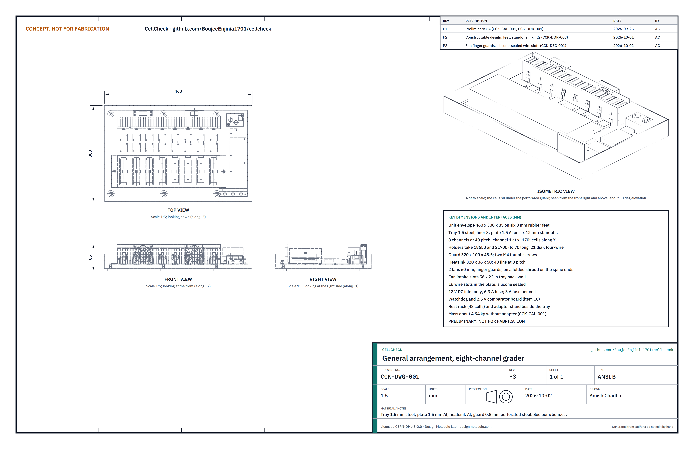

# CellCheck

  

**Area:** Circular Materials · **TRL:** 3 of 9 (proof of concept on paper) · **Prototype budget:** about $175 USD · **Difficulty:** 3 of 5

A second-life battery cell grader: it measures capacity, internal resistance and self-discharge of salvaged lithium cells and sorts them into matched groups for rebuilt packs such as SwapCell.

[Interactive 3D model](media/viewer.html) · [Concept blueprint (PDF)](media/concept-blueprint.pdf) · [General arrangement CCK-DWG-001 (PDF)](cad/drawings/CCK-DWG-001.pdf) · [Sizing note CCK-CAL-001](docs/04-calcs/01-sizing.md) · [Review note](docs/REVIEW.md)

## Concept rationale

Most cells in a discarded laptop, power tool or e-bike pack still work, but nobody knows which ones. CellCheck measures the three things that decide whether a cell is worth reusing: how much charge it holds, how much its voltage sags under load (internal resistance) and whether it leaks charge at rest (self-discharge). It then groups good cells so that each parallel group in a rebuilt pack has nearly the same capacity. Eight independent channels, four-wire contacts and a passive 14-day rest rack keep the tool cheap while grading 12 typical cells in an attended 10 h working day (CCK-CAL-001, a paper estimate with no margin).

It is open and garage-buildable because the people who reuse cells are repair shops, makerspaces and small off-grid installers, not laboratories. It uses off-the-shelf charger and current-monitor modules, runs from a certified 12 V adapter so no one wires mains, and writes its thresholds and results to plain files that anyone can check. A published grading method also lets different workshops compare cells on the same terms.

## Burning platform

The world produced 62 million tonnes of e-waste in 2022, and only 22.3 % was documented as collected and recycled; in Africa the figure was below 1 % ([UNITAR, Global E-waste Monitor 2024](https://unitar.org/about/news-stories/press/global-e-waste-monitor-2024-electronic-waste-rising-five-times-faster-documented-e-waste-recycling)). Much of what is thrown away still has value: IBM Research India found that discarded 85 Wh laptop packs kept a median of 73 % of their design capacity ([Chandan et al., ACM DEV 2014](https://www.dgp.toronto.edu/~mjain/UrJar-DEV-2014.pdf)).

Discarded lithium batteries are also a fire hazard. The US EPA found 245 fires at 64 waste facilities from 2013 to 2020 caused, or likely caused, by lithium-ion batteries ([US EPA, 2021](https://www.epa.gov/system/files/documents/2021-08/lithium-ion-battery-report-update-7.01_508.pdf)), and the UK counted more than 1,200 battery fires in bin lorries and waste sites in the year to May 2024 ([National Fire Chiefs Council and Material Focus](https://nfcc.org.uk/over-1200-battery-fires-in-bin-lorries-and-waste-sites-across-the-uk-in-last-year/)). People who rebuild packs from untested cells face the same hazard on their own benches. Grading keeps usable cells in service and sends the rest to proper recycling instead of the bin.

## Where it could be used

### By industry

| Industry | Use |
| --- | --- |
| Electronics and e-bike repair | Sort cells from dead packs, reject bad ones and rebuild matched packs with a record per cell |
| Battery collection and recycling | Separate reusable cells from those that go to recycling at collection points and micro-factories (ReflowEconomy) |
| Off-grid energy | Low-cost graded cells for lights, small storage packs and solar home kits |
| Education and makerspaces | Teach battery health, safety and measurement with a documented, supervised tool |
| Research | Build data sets of second-life cell capacity and resistance with a published method |

### By country or region

| Country or region | Why it matters there |
| --- | --- |
| United Kingdom | More than 1,200 battery fires in bin lorries and waste sites in the year to May 2024, up from about 700 in 2022 ([NFCC and Material Focus](https://nfcc.org.uk/over-1200-battery-fires-in-bin-lorries-and-waste-sites-across-the-uk-in-last-year/)) |
| United States | 245 lithium-ion battery fires at 64 waste facilities from 2013 to 2020 ([US EPA](https://www.epa.gov/system/files/documents/2021-08/lithium-ion-battery-report-update-7.01_508.pdf)); many repair shops and makers already rebuild packs |
| European Union | Collection targets for portable batteries rise to 63 % by the end of 2027 and 73 % by the end of 2030 under the Batteries Regulation ([EPBA summary](https://www.epba.eu/policy/eu-directive/eu-batteries-regulation)), so more cells will reach sorting points |
| India | The Battery Waste Management Rules, 2022 require all waste batteries to be collected and sent for recycling or refurbishment ([Press Information Bureau](https://www.pib.gov.in/PressReleasePage.aspx?PRID=1854433)); refurbishers need a documented way to test cells |
| Kenya and East Africa | Second-life lithium storage lowered the cost of electricity in 97.2 % of modeled scenarios for Kenyan primary schools ([Hirmer et al., Scientific Reports, 2023](https://www.nature.com/articles/s41598-023-28377-7)); Africa formally recycles less than 1 % of its e-waste ([UNITAR](https://unitar.org/about/news-stories/press/global-e-waste-monitor-2024-electronic-waste-rising-five-times-faster-documented-e-waste-recycling)) |
| Colombia and Latin America | Researchers in Colombia measured cells from laptop packs ranging from 0.04 to 2.50 Ah and showed that grouping by measured values builds better packs ([Olivero-Ortiz et al., PLOS One, 2026](https://journals.plos.org/plosone/article?id=10.1371%2Fjournal.pone.0353394)) |

## What sparked the idea

The starting point was UrJar, a 2014 IBM Research India project in Bangalore that rebuilt cells from 32 discarded ThinkPad laptop packs into lighting units for street vendors ([Chandan et al., ACM DEV 2014](https://www.dgp.toronto.edu/~mjain/UrJar-DEV-2014.pdf)). The study showed that most of the packs still held useful capacity, yet after reading each pack's capacity through the laptop, the researchers selected individual cells by checking that their terminal voltage was above 3.7 V. A voltage check says little about a cell's capacity, internal resistance or self-discharge, which decide how long a rebuilt pack lasts and how safely it ages. CellCheck turns that hand check into a repeatable, multi-channel grading step that any repair bench could run.

## Problem

Salvaged lithium cells are cheap but unknown; building packs from untested cells causes early failure and fires. Cells from one pack can differ widely in capacity and resistance, and in a series string the weakest cell limits the pack and is stressed hardest. Single-cell hobby testers are too slow for pack-scale sorting, and closed multi-slot analyzers do not track self-discharge, build matched groups or keep open records.

Full problem statement: [docs/01-problem.md](docs/01-problem.md)

## Concept

A second-life battery cell grader: it measures capacity, internal resistance and self-discharge of salvaged lithium cells and sorts them into matched groups for rebuilt packs such as SwapCell.

Eight channels each charge a cell at 1 A, measure DC internal resistance with a 0.5 A then 2.0 A pulse in the IEC 61960 pattern, discharge at 1 A to measure capacity and recharge until the cell reads 4.10 V under current. Cells then rest 14 days in a printed rack and come back for a voltage check. Software grades each cell (A, B, C or reject) and builds groups for any series and parallel count, with each parallel group within ±1 % of the mean capacity. A hardware watchdog, per-channel undervoltage comparators and 3 A cell fuses cover single faults. The sizing note CCK-CAL-001 finds 6.33 h of channel time per typical cell, 12.0 cells per attended 10 h day, 33.6 W of peak heat with MOSFET cases at about 59 °C, 460 x 300 x 75 mm and 4.97 kg, and $164 in parts, $11 under the $175 budget.

SwapCell stays in the pitch. Its reference pack uses new high-current cells, which graded laptop cells cannot match, so a second-life variant is planned: the TRL 3 study finds a low-current storage pack for PowerBox (about 334 Wh, 165 W) feasible, and e-bike use is ruled out. Amish decided on 2026-09-25 to go with this recommendation; it needs the SwapCell project's agreement (see the decision records [CCK-DDR-001](docs/decisions/0001-trl2-review-decisions.md) and [CCK-DDR-002](docs/decisions/0002-recommendations-accepted.md)).

Full design precis: [docs/02-concept.md](docs/02-concept.md) · Requirements: [docs/03-requirements.md](docs/03-requirements.md) · Calculations: [docs/04-calcs/01-sizing.md](docs/04-calcs/01-sizing.md)

On paper CellCheck meets 13 of its 17 requirements, and none is failed outright. R5 (throughput), R6 (self-discharge reading) and R11 (mass) are at risk; R10 (containment of a venting cell) cannot be verified at TRL 3.

## Key components

- Eight cell holders for 18650 and 21700 cells with four-wire contacts
- Eight 1 A CC-CV charger modules (TP5100 class)
- Eight INA226-class current and voltage monitors with series charge switches
- Eight constant-current MOSFET loads on a fan-cooled heatsink with vertical fins
- Hardware watchdog and per-channel undervoltage comparators
- Temperature sensing per cell (NTC thermistors)
- ESP32-S3 class controller with display, microSD log and local web page, and grading software
- Steel tray with ceramic fibre liner and a perforated steel cell guard
- Certified 12 V 5 A adapter and a printed 48-cell rest rack

The priced bill of materials is in [bom/bom.csv](bom/bom.csv): $164 in parts against the $175 budget.

## Safety

> Lithium cells can overheat, vent and burn, and salvaged cells can hide damage. Reject damaged cells and any cell below 2.0 V. Grade on a non-flammable surface inside the steel tray, with a smoke alarm and an extinguisher or sand bucket within reach, and stay with the grader whenever a cell is charging or discharging; only cells resting with no current flowing may be left. Isolate any cell that heats or swells in a metal container of sand. Use only a certified 12 V adapter. CellCheck is a research and prototype tool; its grades do not certify any cell or pack as safe.

## Repository layout

| Folder | Contents |
| --- | --- |
| `docs/` | Problem, concept, requirements, calculations and design decisions |
| `cad/src/` | build123d Python source, the source of truth for all geometry |
| `cad/step/`, `cad/stl/` | Exported models for FreeCAD, other CAD tools and printing |
| `cad/drawings/` | General arrangement CCK-DWG-001 (Rev P1) |
| `bom/` | Bill of materials |
| `electronics/` | KiCad schematics and PCB layouts |
| `firmware/` | Microcontroller code |
| `media/` | Renders, perspectives and photos |
| `build-log/` | Dated prototyping notes |

## Documentation

Controlled documents follow the portfolio [documentation standard](.kit/STANDARDS.md). Each carries a document ID (CCK-PRC-001 for the precis), a version and a revision history. Branded PDFs are built with `python .kit/render.py` and attached to GitHub Releases when a document is tagged, for example `CCK-PRC-001/v1.0`.

## Licenses

- **Hardware** (CAD, drawings, BOM, electronics): [CERN-OHL-S v2](LICENSE)
- **Software** (firmware, scripts, notebooks): [MIT](LICENSE-SOFTWARE)

A project of the [Design Molecule](https://designmolecule.com) lab.
