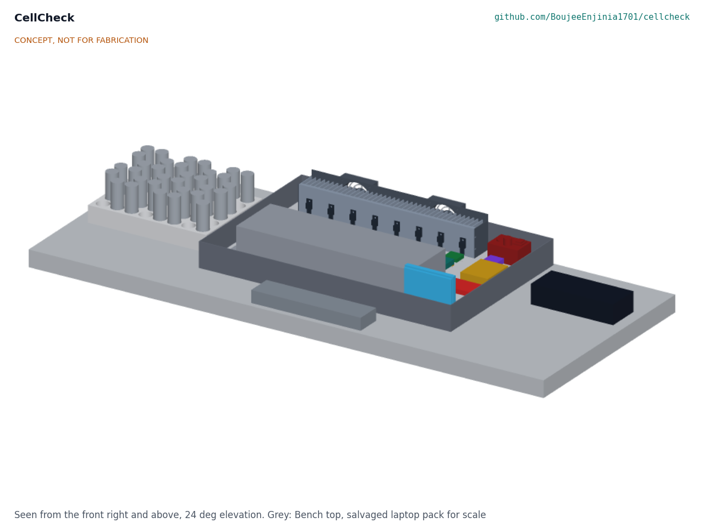
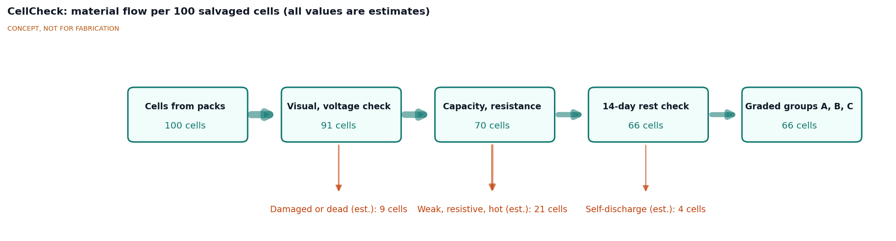
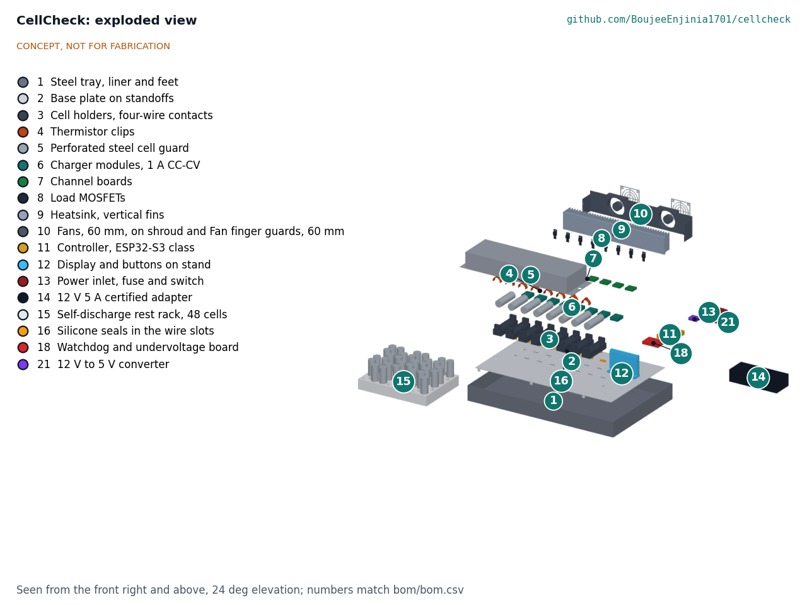

# CellCheck design precis

## Summary

CellCheck is an eight-channel bench grader for salvaged 18650 and 21700 lithium-ion cells. Each channel charges one cell, measures its DC internal resistance with a two-step current pulse, discharges it at a constant 1 A to measure capacity, and recharges it for a 14-day self-discharge rest. Software then sorts the passing cells into grades and builds matched groups for a pack of a chosen series and parallel count, with a record for every cell. The calculation note CCK-CAL-001 finds 6.33 h of channel time per typical cell, 12.0 cells per attended 10 h day, MOSFET cases at 58.7 °C at full load and $172.40 in parts, $2.60 under the $175 value-engineering target that Amish accepted on 2026-09-25 to cover the single-fault protection added for TRL 3. Every figure is a paper estimate; nothing has been built or measured.

*Figure 1. Massing model on a bench: steel tray with eight cell channels (center), rest rack for the self-discharge check (left), 12 V adapter (right) and a salvaged laptop pack (front) for scale.*

## How it works

1. **Intake (by hand).** The operator removes cells from a pack, rejects any with dents, torn wraps, leaks or corrosion, measures open-circuit voltage and rejects cells below 2.0 V. Each cell gets an ID label. Cells below 2.0 V are not revived: deep discharge can grow copper dendrites that cause internal shorts when the cell is charged again.
2. **Charge.** The cell goes into a channel. A 1 A CC-CV charger module brings it to 4.20 V and stops at 0.1 A (about 1.8 h for a 1.8 Ah cell). A thermistor clipped to the cell stops the channel if the cell passes 45 °C or rises more than 8 K above the bench. If a cell's reading does not rise at all during charge or discharge, the firmware treats the clip as detached and stops the channel.
3. **Rest and resistance.** After a 30 min rest, and only once the cell is within 1 K of the bench reading (a firmware rule, CCK-DDR-001 item 13), the channel runs a DC resistance test in the pattern of IEC 61960: 0.5 A for 10 s, then 2.0 A for 1 s, with resistance taken as the change in voltage over the change in current ([test pattern summarized by Arbin Instruments](https://www.arbin.com/how-to-perform-internal-resistance-measurement-accroding-to-iec-61960-with-arbin.html)). IEC 61960 uses 0.2C and 1C; CellCheck uses fixed currents so results are comparable within a batch, not with data sheet values.
4. **Capacity.** A linear constant-current load discharges the cell at 1.0 A to 2.80 V while a current monitor integrates ampere-hours and watt-hours. Cell temperature is logged throughout; a cell that heats abnormally is flagged.
5. **Recharge for rest.** The charger runs at 1 A until the cell's terminal voltage reads 4.10 V under current, at about 80 % state of charge, and the firmware then opens the charge switch. The operator moves the cell to the printed rest rack, which holds 48 cells.
6. **Self-discharge check.** After 14 days the operator puts the cell back into a channel for a 10 s open-circuit reading. Each cell goes back into the channel it was graded in, which keeps the reading within ±2.3 mV (CCK-CAL-001 v0.2), and its drop is compared with the median drop of the cells charged the same day. A drop of more than 50 mV beyond that median marks the cell as rejected (CCK-DDR-001 item 13, decided by Amish, 2026-09-25).
7. **Grade and match.** Software assigns a grade from capacity, resistance, heating and self-discharge (Table 2), then builds groups for the pack the user wants (for example 4S6P): it picks the cells of one grade with the narrowest capacity window, distributes them with a serpentine sort and swaps cells between groups until each parallel group's total capacity is within ±1 % of the mean. On synthetic data the groups come out within 0.006 % (CCK-CAL-001 section 9). Serpentine sorting of retired 18650 cells has been studied as a grouping method ([Xi et al., Batteries, 2026](https://www.mdpi.com/2313-0105/12/9/368)), and clustering by measured capacity and resistance produced a markedly better second-life pack than random selection in a recent study ([Olivero-Ortiz et al., PLOS One, 2026](https://journals.plos.org/plosone/article?id=10.1371%2Fjournal.pone.0353394)).
8. **Record.** Every cell gets a CSV row: ID, source pack, cell model if known, arrival voltage, capacity, resistance, temperature rise, self-discharge, grade, group and dates. Each matched group and each lot of rejected cells also gets a ReflowEconomy material passport record (CCK-CAL-001 section 13). Rejected cells go to a battery collection point for recycling.

*Figure 2. Material flow per 100 cells taken from salvaged packs (all values are estimates). The first loss draws on the 4.3 % of cells with surface damage found by [Salinas et al. (2019)](https://www.sciencedirect.com/science/article/abs/pii/S2352152X18308399) plus an assumed 5 % below 2.0 V; the other losses are assumptions to be checked with real cells.*

## Main components

Table 1. Main components, numbered as in the exploded view (Figure 3), `bom/bom.csv` and the general arrangement CCK-DWG-001.

| # | Component | Choice | Notes |
| --- | --- | --- | --- |
| 1 | Steel tray with liner | 460 x 300 x 45 mm steel tray, 1.5 mm, 3 mm ceramic fibre sheet on the floor, two fan intake slots in the back wall | Contains ejecta from a venting cell; the whole unit sits in it |
| 2 | Base plate | 1.5 mm aluminium, 430 x 270 mm, on six standoffs screwed to the tray through rubber feet (line 19) | Carries all modules |
| 3 | Cell holders | Eight holders for 18650 and 21700 at a 40 mm pitch with spring contacts, separate force and sense contacts at each end (four-wire) | Kelvin sensing keeps contact resistance out of the reading |
| 4 | Temperature sensing | 10 kΩ NTC thermistor in a printed C-clip on each cell | Read by the controller's ADC, ±1.0 K at 45 °C |
| 5 | Cell guard | Folded perforated steel cover over the cells, held by two thumb screws | Stops loose ejecta; cells stay visible; lifts off to change cells |
| 6 | Chargers | 1 A CC-CV buck charger module per channel, 4.20 V, fed from 12 V (TP5100 class) | Module sets its own voltage limit, independent of firmware |
| 7 | Channel boards | INA226-class current and voltage monitor with a 25 mΩ shunt on a perfboard with the series charge switch, the op-amp of the load loop and the 3 A channel fuse, per channel | 16-bit readings over I2C at addresses 0x40 to 0x47; calibrated per channel at build |
| 8 | Load MOSFETs | Logic-level MOSFET in TO-220 with an op-amp loop per channel, constant current 0.5 to 2.0 A | Linear load; energy ends up as heat |
| 9 | Heatsink | Aluminium spine 320 x 6 x 50 mm with 40 vertical fins 30 mm deep at 8 mm pitch | 0.58 K/W with the fans (CCK-CAL-001) |
| 10 | Fans | Two 60 mm 12 V fans with tachometers on a shroud behind the fins, pushing air forward into the fin channels | Air leaves through the open fin tops |
| 11 | Controller | ESP32-S3 class board | Runs the test sequence, logs to microSD, serves a local web page |
| 12 | Display and buttons | 2.8 in display with three buttons on a printed stand | Channel status without a laptop |
| 13 | Power inlet | DC jack, 6.3 A main fuse, switch in a printed housing | Only 12 V DC enters the unit |
| 14 | Power supply | Certified 12 V 5 A mains adapter | No mains wiring inside CellCheck |
| 15 | Rest rack | 3D-printed rack for 48 cells, numbered slots | Holds cells for the 14-day check |
| 18 | Watchdog and undervoltage board | Hardware watchdog gating all charge and load enables; eight 2.5 V comparators removing load gate drive | Added for R9 (CCK-DDR-001 item 3) |
| 21 | 5 V converter | 12 V to 5 V 3 A buck converter | Feeds the controller, display and channel boards (CCK-DDR-003) |

Lines 16 (wiring and 3 A channel fuses) and 17 (labels and insulator rings) are in the BOM but not modelled; line 19 (rubber feet) is drawn with the tray and line 20 (fixings) with the parts they hold. The general arrangement drawing is CCK-DWG-001 Rev P2 (`cad/drawings/CCK-DWG-001.pdf`), generated from `cad/src/model.py`.

*Figure 3. Exploded view. Numbers match Table 1 and `bom/bom.csv`. Grey cells are not supplied.*

## Grading rules

Table 2. Grades. The thresholds are starting values decided by Amish on 2026-09-25 (CCK-DDR-001 item 5), to be tuned with the first 100 real cells at TRL 4, which is on hold. All live in a plain configuration file.

| Grade | Capacity, share of rated | DC resistance (18650 default) | Other conditions | Suggested use |
| --- | --- | --- | --- | --- |
| A | 80 % or more | 60 mΩ or less | Temperature rise 8 K or less at 1 A; self-discharge 50 mV or less in 14 days | Storage packs at 0.5C or less |
| B | 65 % or more | 100 mΩ or less | As A | Storage and lighting packs at 0.3C or less |
| C | 50 % or more | 150 mΩ or less | As A | Low-drain uses only: lights, small sensor nodes |
| Reject | Below 50 % | Above 150 mΩ | Or any failed condition, arrival voltage below 2.0 V, or visible damage | Battery recycling |

Rated capacity comes from the cell model printed on the wrap, looked up in a cell table; if the model is unknown, the grade uses measured capacity only and the record says so. The 60 mΩ default for grade A is an assumption for a typical laptop 18650 in good health; Amish decided on 2026-10-02 (CCK-DEC-001, item 6) to keep it as the default and to add per-model limits only for the few cell models most common in the trial partner's intake, set from DC resistance measured on known-good cells of each model. Data sheet impedance is not used, because it is normally a 1 kHz AC value and reads lower than CellCheck's DC pulse. At 1 A a 60 mΩ cell warms by about 1.4 K and the worst 418 mΩ cell reported by Olivero-Ortiz et al. by about 10 K, so the 8 K limit separates them.

## Key numbers

All values come from CCK-CAL-001 and are paper estimates.

Table 3. Key numbers.

| Quantity | Value | Requirement |
| --- | --- | --- |
| Channel time per cell | 6.33 h for 1.8 Ah; 8.30 h for 2.5 Ah; 13.93 h for a 4.5 Ah 21700 | |
| Throughput | 12.0 cells per attended 10 h day: a current stage starts only if it finishes the same day (decided 2026-10-02; the overnight pause, 12.8, is not used) | R5 at risk |
| Cells for one 4S6P pack | about 36 candidates, about 3 attended days plus the 14-day rest | |
| Capacity error | ±1.1 % without calibration, ±0.4 % with | R2 met |
| Voltage error | ±12.4 mV without calibration, ±4.8 mV after per-channel calibration | R3 met with calibration |
| Resistance | 0.83 mΩ per count; repeatability ±2.09 mΩ worst case at 60 mΩ with the pulse gated within 1 K | R4 met |
| Self-discharge reading | ±2.3 mV in the same channel, against the same-day cohort median; relaxation spread not bounded | R6 at risk |
| Heat at full discharge load | 29.2 W average, 33.6 W peak | |
| Heatsink | 0.58 K/W with fans (1.07 K/W needed); MOSFET cases 58.7 °C at 35 °C room; about 99 °C if the fans stop | R8 met |
| Adapter load, all channels charging | 42.5 W of 60 W; 3.54 A at 12 V | R13 met |
| Energy per cell from the mains | 16.8 Wh, well under $0.01 at $0.15/kWh | |
| Size and mass | 460 x 300 x 85 mm; 4.94 kg without adapter | R11 at risk |
| Parts cost | $177.60 estimated against the $175 value-engineering target | R12 over the value-engineering target ($2.60 over) |

## Key design choices

These were decided by Amish on 2026-09-25 (CCK-DDR-001 and CCK-DDR-002: go with recommendation).

- **Linear load, eight channels (item 7).** Discharge energy (6.6 Wh per typical cell) is burned in MOSFETs on one heatsink. A bidirectional converter per channel would recover it but costs more than the value-engineering target allows. Sixteen channels and regenerative discharge are later variants.
- **Modules (item 6).** TP5100-class charger, INA226-class monitor with a 25 mΩ shunt, ESP32-S3 class controller.
- **Single-fault protection (item 3).** A hardware watchdog removes all charge enables and load gate drive when the controller stops; a per-channel comparator removes load gate drive below 2.5 V; each cell has a 3 A fuse and a series charge switch.
- **Attended operation (item 2).** Charge, pulse and discharge run only with a person present; the rest stage may be left.
- **Four-wire DC resistance and a 14-day rest (item 11).** DC pulses (no signal generator; closer to behaviour under load) and 14 days (7 days catches only the worst cells).
- **Firmware and build rules (item 13).** The resistance pulse starts only within 1 K of the bench; self-discharge is read in the same channel and against the same-day cohort median; each channel gets a two-point voltage calibration at build; discharges stop on a fan or heatsink fault; a thermistor that shows no rise during current flow is treated as detached. These are rules for the firmware sketch; writing, calibrating and testing them is TRL 4 work and on hold.
- **Value-engineering target (item 4).** $175 in parts, a hypothetical control target, not a limit, raised from $160 to cover the single-fault protection with margin.
- **12 V DC input only.** A certified adapter keeps mains out of the unit, so builders never wire mains.
- **Local-first data (item 9).** Records stay on the microSD card and the local web page; no cloud account is needed. Groups and reject lots map to ReflowEconomy's material passport v0.2.
- **Lithium-ion first, LFP later (item 8).** The first release covers LCO, NMC and NCA cells at 4.20 V. An LFP profile (3.65 V charge, 2.5 V discharge limit) follows once the lithium-ion profile is proven.
- **Heatsink orientation.** The TRL 2 model had fins across the fan airflow. The fins are now vertical plates normal to the heatsink length, so the fans push air along the channels and out of the top.

## Relation to other lab projects

- **SwapCell.** The pitch keeps SwapCell (CCK-DDR-001 item 1, decided by Amish, 2026-09-25). SwapCell's reference pack uses new 5 Ah 21700 cells carrying 10 A continuous each, which graded laptop cells cannot match. The TRL 3 study (CCK-CAL-001 section 10) finds a 13S4P second-life pack of grade A cells feasible as a low-current storage pack for PowerBox, about 334 Wh and 165 W, with PowerBox's AC output limited to about 150 W; e-bike use is ruled out. The variant needs the SwapCell project's agreement and its own pack design. Decided by Amish, 2026-10-02 (CCK-DEC-001, item 11): the study is sent to the SwapCell and PowerBox projects as a proposal, and CellCheck takes no further action on it.
- **CellGuard.** Packs rebuilt from graded LFP cells would use CellGuard; lithium-ion packs depend on CellGuard's NMC profile, which was decided for CellGuard on 2026-09-25 (hardware for both, LFP firmware first).
- **ReflowEconomy.** CellCheck is the grading step for the battery stream in ReflowEconomy's micro-factory, where cells that cannot be reused are exported for industrial recycling. Two passport schema gaps are raised with that project (CCK-DDR-001 item 15).

## Safety

> **Safety:** Salvaged lithium-ion cells can have hidden damage and can overheat, vent flammable and toxic gas, and burn. Work on a non-flammable surface, with a smoke alarm and a Class D or large dry-powder extinguisher or a sand bucket within reach. Stay with the grader whenever a cell is charging or discharging; only cells resting with no current flowing may be left.

- **Pack disassembly.** Removing spot-welded nickel strip can short cells or tear wraps. Use insulated tools, cut one strip at a time, wear eye protection and gloves, and tape exposed terminals.
- **Damaged and deeply discharged cells.** Reject cells with any visible damage and cells below 2.0 V. Do not try to revive them.
- **Charging.** Each charger module limits voltage to 4.20 V by itself; the firmware adds voltage, current, temperature and time limits and opens the series charge switch. A cell that passes 45 °C or rises 8 K above the bench is disconnected and flagged; the operator moves it to a metal container of sand once it is cool.
- **Single faults.** The watchdog, undervoltage comparators and 3 A channel fuses cover the faults in R9 on paper (CCK-CAL-001 Table 3). A thermistor clip that falls off is caught only by the plausibility check, which is untested, so it remains a residual risk. None of this is tested.
- **Heat.** MOSFET cases reach about 59 °C with the fans running and could approach 99 °C if both fans stopped, so the firmware stops discharges on a fan or heatsink fault. Keep hands off the heatsink during discharge.
- **Containment.** The steel tray, ceramic fibre liner and steel guard are meant to hold ejecta from one venting cell. This cannot be verified on paper and must not be relied on. The fan intake slots are an opening in the tray wall. The guard is held by two thumb screws, and the TRL 4 containment test is to be run with it held that way; the wire slots under the guard are sealed round their leads with high-temperature silicone after wiring (CCK-DEC-001, items 1 and 2, decided 2026-10-02).
- **Fans.** The two fans carry finger guards (CCK-DEC-001, item 9).
- **Transport and storage.** Store graded cells at about 3.7 V in a non-flammable container with terminals covered. Rejected cells go to a battery collection point, never to household waste.
- **Scope.** CellCheck is a research and prototype tool. Its grades do not certify any cell or pack as safe.

## Open questions

- [x] First trial partner (item 10). Decided 2026-10-02: a local Repair Café group that passes laptop batteries to a collection point is the first candidate to approach, with that collection point as the source of trial cells.
- [x] Scheduling rule for the attended day (item 12). Decided 2026-10-02: a current stage starts only if it finishes the same day.
- [x] Responses to R11 and R5 (item 14). Decided 2026-10-02: accept the mass (4.91 kg then, 4.94 kg with the finger guards and silicone) with the 1.5 mm tray and weigh at TRL 4; throughput by the same-day rule, more channels later.
- [x] Grade A resistance limit per cell model (item 16). Decided 2026-10-02: 60 mΩ default; per-model limits from measured DC resistance for the commonest models only.
- [ ] ReflowEconomy passport gaps: decided to raise with that project (item 15); cross-repo action.
