# CellCheck prototype build plan

**Plan, not yet built.** How to build the first proof-of-concept prototype, component by component. Building and testing to it is TRL 4 work. Decisions still to be made are kept in the design decisions register ([docs/06-design-decisions.md](06-design-decisions.md)), not here.

## 1. What you are building

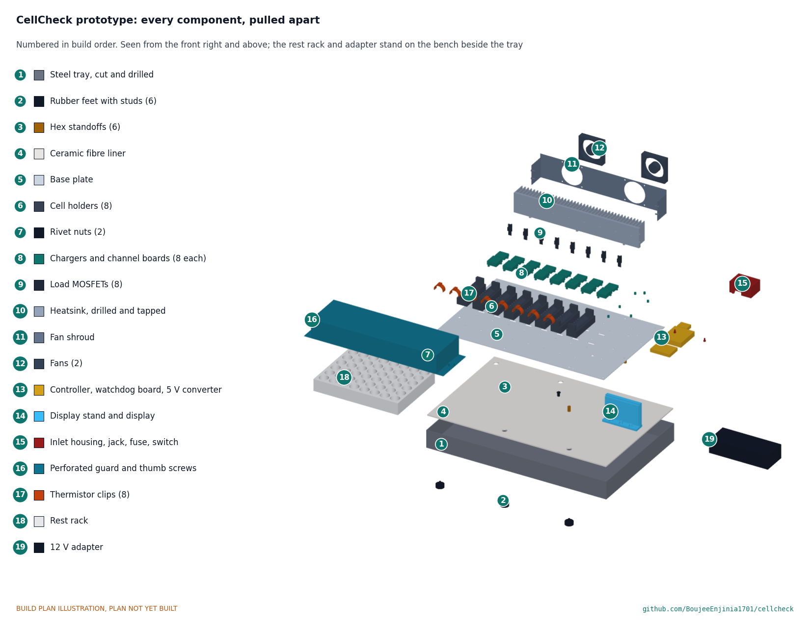

*Figure 1. Every component pulled apart and numbered in build order. The rest rack (18) and the adapter (19) stand on the bench beside the tray.*

The prototype is an eight-channel cell grader built into a steel tray that stands on six rubber feet. Inside the tray a ceramic fibre liner covers the floor, and an aluminium base plate on six standoffs carries everything else: eight cell holders under a lift-off perforated steel guard, a charger module and a channel board for each channel, eight load transistors on a finned heatsink with two fans behind it, and a controller, watchdog board, 5 V converter, display and power inlet on the right. A printed rack beside the tray holds 48 cells during their 14-day rest, and a certified 12 V adapter powers the unit. Figure 1 shows the 19 components in the order you make or fit them. Ten are made or worked in a small workshop: the tray (cut and drilled), the liner, the base plate, the heatsink (drilled and tapped), the fan shroud, the guard, and four printed parts (display stand, inlet housing, thermistor clips and rest rack). Everything else is bought and fitted. The work is cutting, drilling, tapping and folding aluminium and steel sheet, cutting ceramic fibre, 3D printing, and wiring bought modules with soldered and crimped joints. The parts cost about $172 from the bill of materials.

> **Safety:** CellCheck charges and discharges salvaged lithium-ion cells, which can overheat, vent flammable and toxic gas, and burn. Keep every cell out of the workshop until stop S1 in section 6, out of the holders until stop S5, and never leave a cell charging or discharging unattended. Ceramic fibre dust irritates the lungs and skin: cut it with a dust mask, gloves and long sleeves. Cut steel and aluminium edges are sharp: deburr everything and wear cut-resistant gloves for sheet work. The unit uses only 12 V from a certified adapter; never wire mains into it.

## 2. What changed to make it buildable

The concept showed what the grader does; most of its parts had no fixing, two had no room for what goes in them, and three parts the electronics need were missing. Each change below keeps what the grader does, and all of them are recorded in decision record CCK-DDR-003, open for Amish's review.

*Table 1. Changes from the concept.*

| Component | The concept had | The buildable design has | Why |
| --- | --- | --- | --- |
| Tray, standoffs and feet | Four standoffs resting loose on the soft liner | Six rubber feet whose studs pass up through the tray floor into six standoffs on the bare steel (Figure 3) | The plate is fixed to the tray, and the standoffs bear on steel |
| Base plate | 2 mm sheet on four standoffs, two screws hidden under the display and inlet | 1.5 mm sheet on six standoffs, every screw reachable from above (Figure 6) | Keeps the unit under its 5 kg limit after the added fixings |
| Cell holders and leads | No fixing; no way for the leads out of the guard | Two screws from below per holder; two wire slots per channel through the plate, leads run underneath (Figures 6 and 18) | The guard stays closed on every side |
| Guard | A frame of bars with no fixing | A folded perforated steel box with end flanges, held by two thumb screws into rivet nuts (Figure 16) | It lifts off for a cell change without tools |
| Boards | Sitting on the aluminium plate | Each on two 5 mm nylon standoffs (Figure 7) | Solder joints cannot short to the plate |
| Display stand | 60 mm wide, too small for a 2.8 in display module | 88 mm wide printed stand with the buttons in its foot (Figure 12) | The bought display fits |
| Heatsink and shroud | No fixings; the shroud's top lip could not be folded | Screws into the spine from below and at each end; MOSFETs clamped with insulated screws; shroud folded with side flanges (Figures 9 and 11) | Every part is fixed and can be made from one sheet |
| Thermistor clip | A block resting on the cell | A printed C-clip that springs over the cell (Figure 18) | It holds itself and the thermistor touches the cell |
| Power inlet | Jack facing the tray wall 23 mm away | Jack, fuse holder and switch on top of a printed housing (Figure 14) | Room for the plug; no new hole in the tray |
| Electronics | No 5 V supply; no home for the load loop's op-amp, the charge switch or the channel fuse | A 5 V converter; each channel's current monitor on a small perfboard with the charge switch, op-amp and fuse clips (Figure 20) | Everything the protection relies on exists and the fuses can be reached |

## 3. Making the components

Make and check each component before the assembly step that needs it. Sizes are in millimetres. "Left" and "right" are as seen standing in front of the grader, where the cells are; "front" is the side nearest you. Workshop tolerance is 0.5 mm unless a step says otherwise; drawings do not carry tolerances before TRL 4.

### 3.1 Steel tray

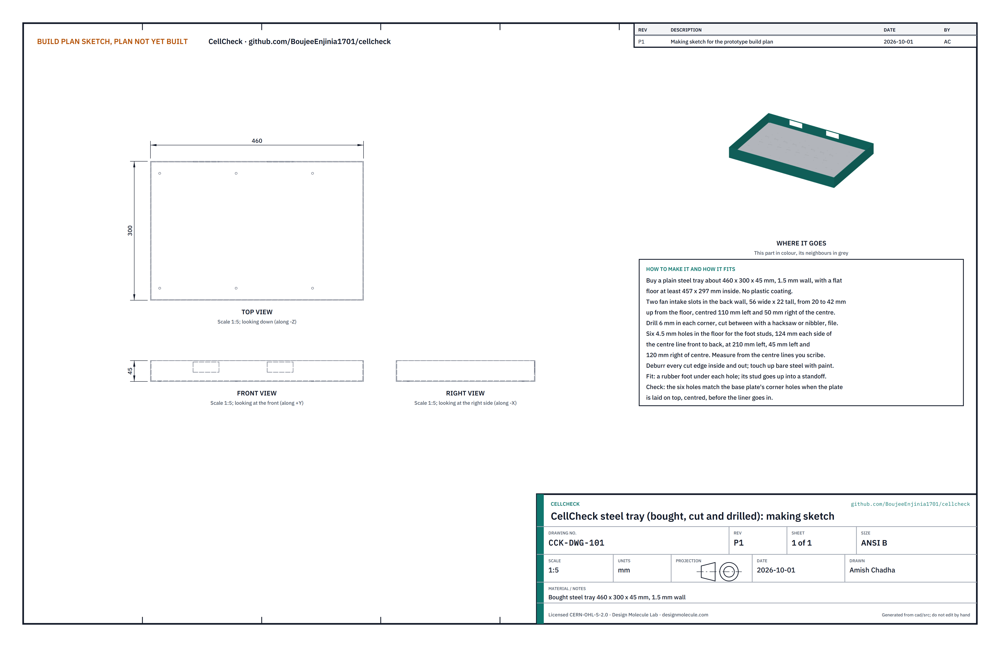

*Figure 2. Steel tray making sketch (CCK-DWG-101).*

**What it is and what it is made from.** The open steel tray that everything sits in, and the first line of containment if a cell vents. A bought plain steel tray, about 460 x 300 x 45 mm with 1.5 mm walls and a flat floor at least 457 x 297 mm inside, with no plastic coating.

**How to make it.**

1. Scribe a centre line across the floor from left to right and another from front to back, inside and outside.
2. Mark two fan intake slots on the back wall, each 56 wide and 22 tall, running from 20 to 42 up from the floor, centred 110 left and 50 right of the centre line.
3. Drill a 6 mm hole in each corner of each slot, cut between the holes with a hacksaw or nibbler, and file the edges straight.
4. Mark six stud holes in the floor, 124 each side of the left-to-right centre line, at 210 left, 45 left and 120 right of the front-to-back centre line. Centre punch and drill 4.5 mm.
5. Deburr every cut inside and out and touch up bare steel with paint so it does not rust.

**How it fits the parts next to it.**

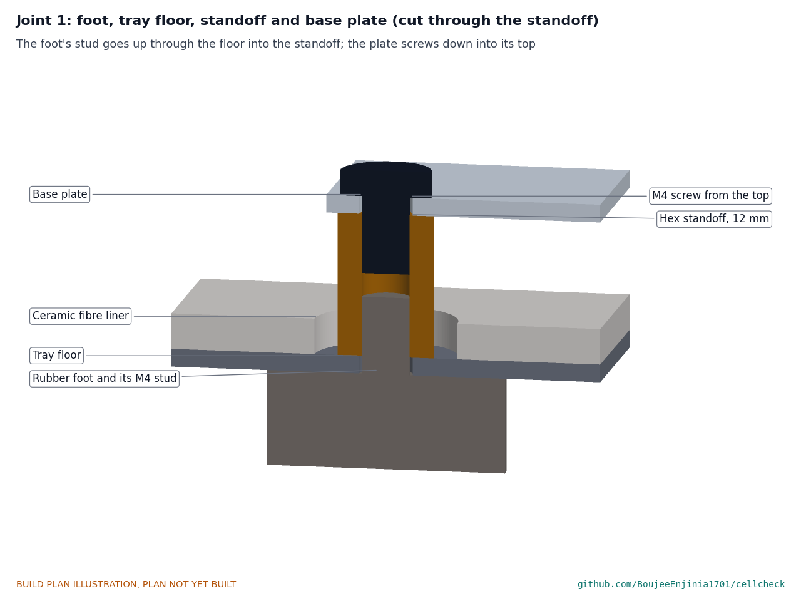

*Figure 3. A rubber foot under the floor; its stud goes up through the floor into a hex standoff, and the base plate screws down onto the standoff's top.*

Each rubber foot sits under a stud hole; its M4 stud passes through the 1.5 mm floor and screws into the bottom of a 12 mm hex standoff, which stands on the bare steel through a hole in the liner. The tray stands 8 mm off the bench on the six feet.

**Check before moving on.** Lay the base plate on top of the tray, centred, and look down through its six standoff holes: each must line up with a stud hole in the floor.

### 3.2 Ceramic fibre liner

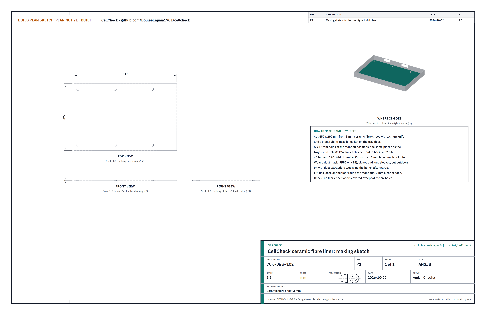

*Figure 4. Ceramic fibre liner making sketch (CCK-DWG-102).*

**What it is and what it is made from.** A heat-resisting sheet on the tray floor under everything. Ceramic fibre sheet 3 mm thick.

**How to make it.**

1. Work outdoors or with dust extraction, wearing a dust mask (FFP2 or N95), gloves and long sleeves.
2. Cut a piece 457 x 297 with a sharp knife against a steel rule, and trim it so it lies flat on the tray floor.
3. Mark the six standoff positions through the stud holes from below, and cut a 12 mm hole at each with a hole punch or knife.
4. Wet-wipe the bench and bag the offcuts.

**How it fits the parts next to it.** It lies loose on the floor; each standoff stands in a liner hole with 2 mm clear all round (Figure 3).

**Check before moving on.** No tears; the floor is covered everywhere except the six holes.

### 3.3 Base plate

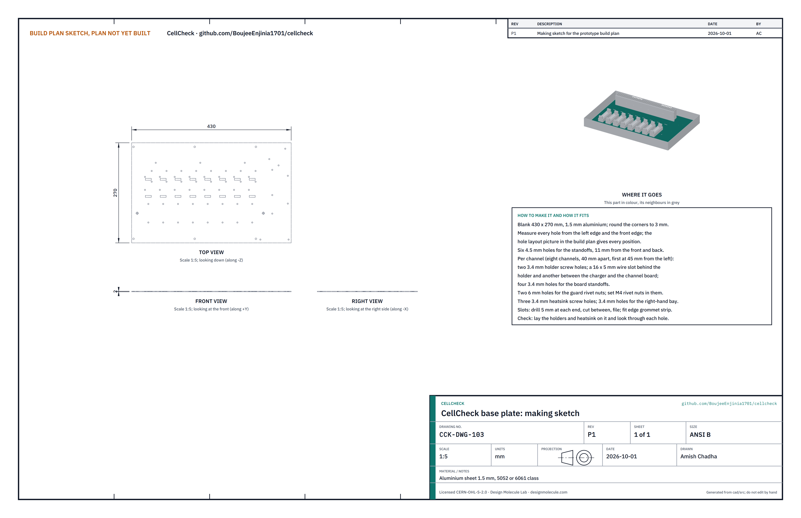

*Figure 5. Base plate making sketch (CCK-DWG-103).*

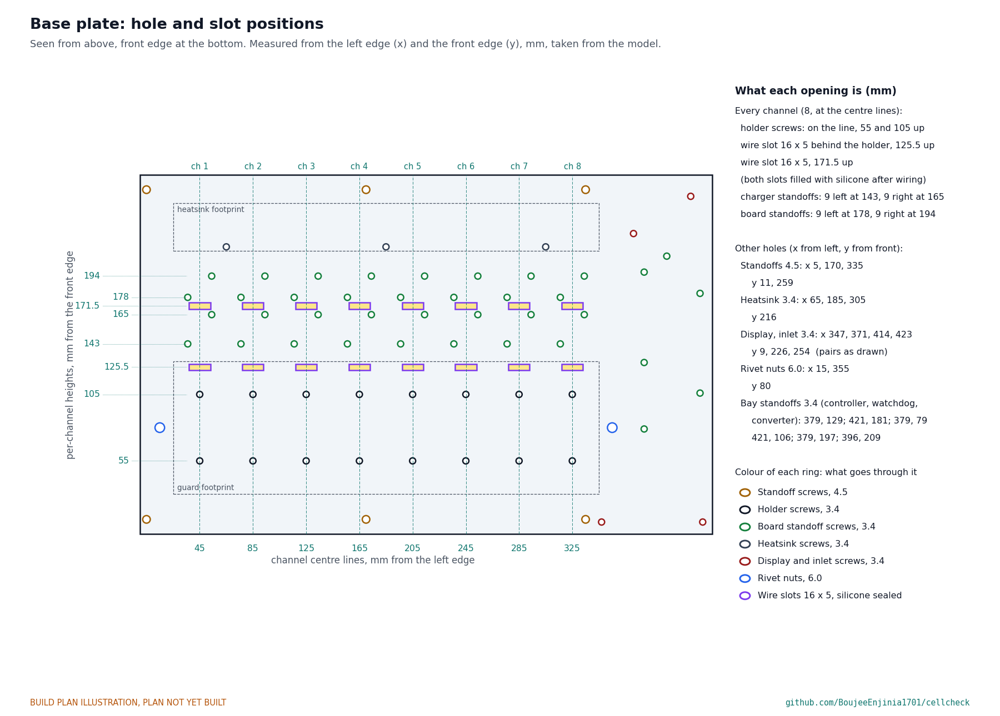

*Figure 6. Every hole and slot, measured from the left edge and the front edge. Each ring's colour says what goes through it.*

**What it is and what it is made from.** The flat plate that carries every part inside the tray. Aluminium sheet 1.5 mm thick, 5052 or 6061 class, cut to 430 x 270.

**How to make it.**

1. Cut the blank square to 430 x 270, file the edges and round the corners to about 3 mm.
2. Choose the top face and mark it. Mark the front edge.
3. Scribe the eight channel centre lines from front to back, 40 apart, the first 45 from the left edge (Figure 6).
4. On each channel line mark, measured up from the front edge: holder screw holes at 55 and 105; a wire slot centred at 125.5; a wire slot centred at 171.5; charger standoff holes 9 left of the line at 143 and 9 right at 165; channel board standoff holes 9 left at 178 and 9 right at 194.
5. Mark the other holes from the key of Figure 6: six standoff holes, three heatsink screw holes, two rivet nut holes, and the holes for the controller, watchdog board, converter, display stand and inlet housing.
6. Drill the standoff holes 4.5 mm, the rivet nut holes 6 mm and all the others 3.4 mm.
7. Wire slots, 16 long and 5 wide: drill 5 mm at each end, cut between with a fine saw or nibbler, and file square. Fit edge grommet strip round each slot.
8. Deburr every hole on both faces.
9. Set an M4 blind rivet nut in each 6 mm hole with the hand tool, its thin head on the top face.

**How it fits the parts next to it.** The plate's underside sits on the six standoffs, held by six M4 screws from the top (Figure 3); under it the cell leads run in a 9 mm space above the liner. Every other part stands on its top face.

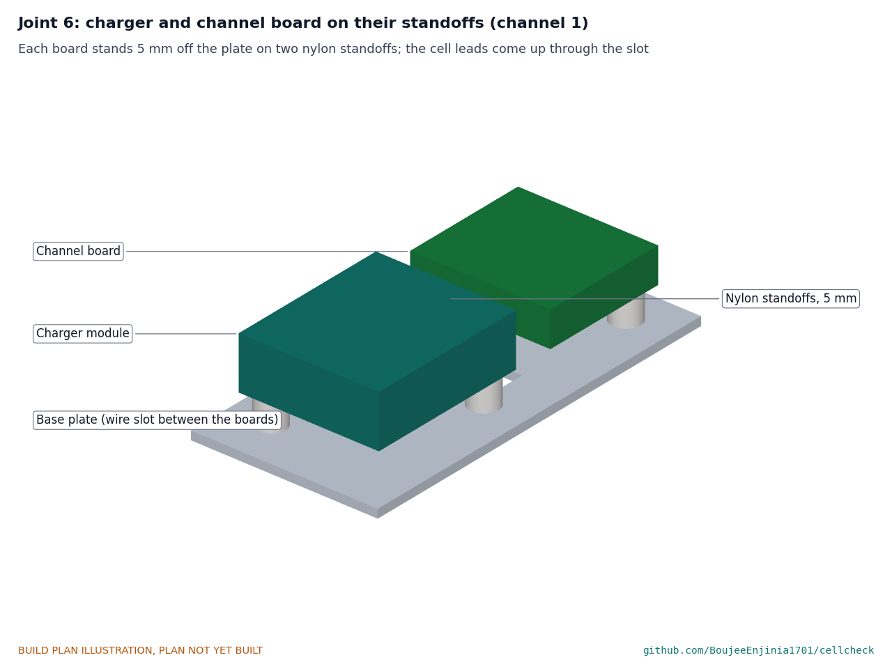

*Figure 7. Each board stands 5 mm off the plate on two nylon standoffs; the cell leads come up through the slot between the two boards.*

**Check before moving on.** Lay a cell holder, a charger module and the heatsink on the plate and look through each hole: the holes must line up without forcing a screw. Both rivet nuts take an M4 screw.

### 3.4 Heatsink, drilled and tapped

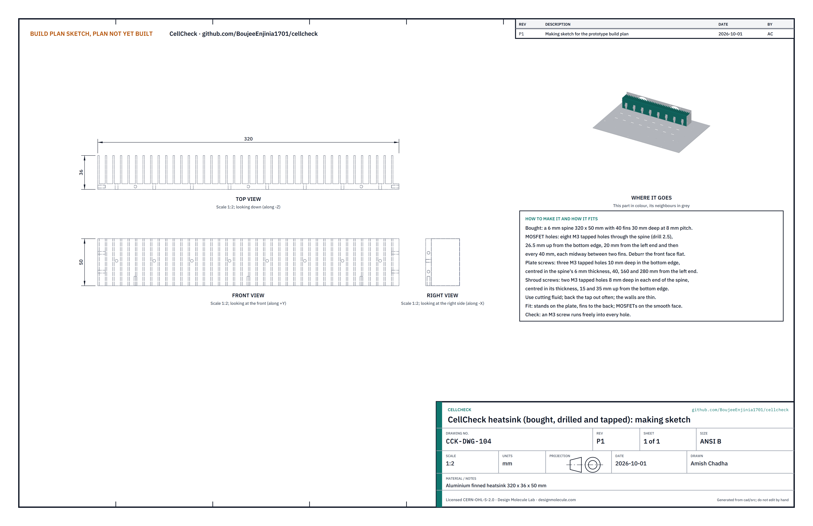

*Figure 8. Heatsink drilling sketch (CCK-DWG-104).*

**What it is and what it is made from.** The finned aluminium block that takes the heat from the eight load transistors. Bought: a 6 mm spine 320 long and 50 tall with 40 fins 30 deep at 8 mm pitch, worked with drill and tap.

**How to make it.**

1. Mark the smooth face of the spine (the front). Its bottom edge stands on the plate.
2. Transistor holes: eight on the front face, 26.5 up from the bottom edge, the first 20 from the left end and then every 40. Each must fall midway between two fins; check from the back before drilling. Drill 2.5 mm through the spine and tap M3.
3. Plate screw holes: three in the bottom edge, centred in the 6 mm thickness, 40, 160 and 280 from the left end. Drill 2.5 mm 10 deep and tap M3.
4. Shroud screw holes: two in each end of the spine, centred in its thickness, 15 and 35 up from the bottom edge. Drill 2.5 mm 8 deep and tap M3.
5. Use cutting fluid and back the tap out often; the walls round the bottom and end holes are under 2 mm.
6. Deburr the front face so it is flat for the transistor tabs.

**How it fits the parts next to it.**

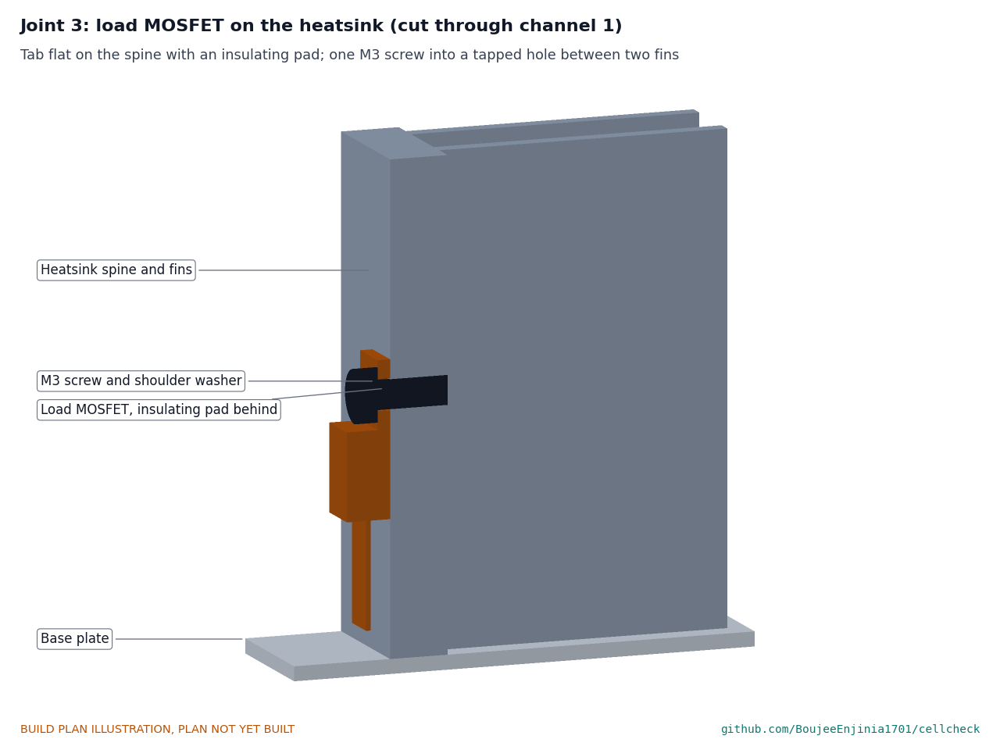

*Figure 9. The transistor tab sits flat on the spine with an insulating pad behind it; one M3 screw with a shoulder washer goes into the tapped hole between two fins.*

The heatsink stands on the plate with its fins to the back, held by three M3 screws up from under the plate into its bottom edge. Each load transistor (a TO-220 MOSFET) is clamped to the front face over an insulating pad, so its tab does not connect to the heatsink.

**Check before moving on.** An M3 screw runs in freely by hand in every tapped hole.

### 3.5 Fan shroud

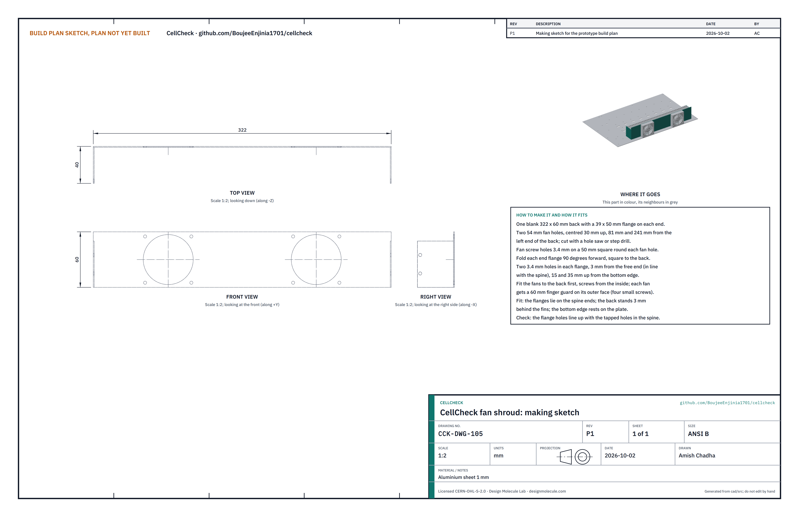

*Figure 10. Fan shroud making sketch (CCK-DWG-105).*

**What it is and what it is made from.** The folded sheet behind the fins that carries the two fans and makes their air go forward through the fins and out of the top. Aluminium sheet 1 mm.

**How to make it.**

1. Mark one blank: a back 322 long and 60 tall, with a flange 39 wide and 50 tall on each end, level with the bottom edge.
2. Cut two 54 mm fan holes, centred 30 up and 81 and 241 from the left end of the back, with a hole saw or step drill.
3. Drill four 3.4 mm fan screw holes on a 50 mm square round each fan hole.
4. Drill two 3.4 mm holes in each flange, 3 from its free end and 15 and 35 up from the bottom edge.
5. Fold each flange 90° forward, square to the back. Deburr everything.
6. Screw each fan to the back with four fan screws put in from the inside, the fan blowing forward through the hole.

**How it fits the parts next to it.**

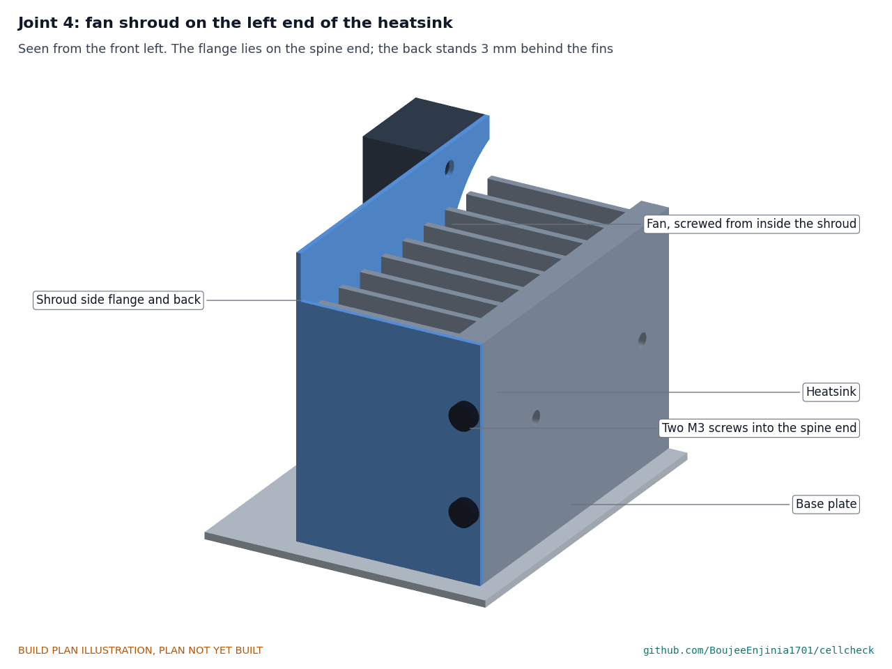

*Figure 11. The flange lies flat on the end of the spine and is held by two M3 screws; the back stands 3 mm behind the fins.*

The flanges lie on the two ends of the spine, held by two M3 screws each; the back stands 3 mm behind the fins with its bottom edge resting on the plate, and the fans sit 15 mm in front of the tray's back wall, facing the intake slots.

**Check before moving on.** Hold the shroud on the heatsink: the flange holes line up with the tapped holes in the spine ends.

### 3.6 Display stand

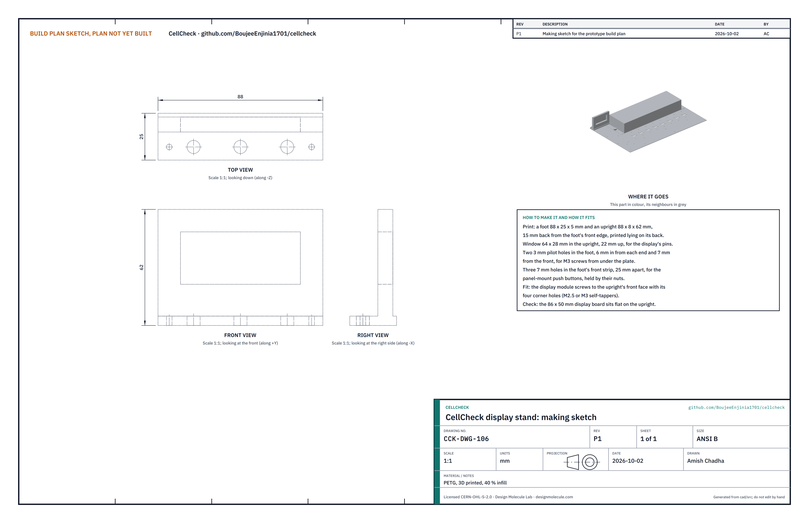

*Figure 12. Display stand making sketch (CCK-DWG-106).*

**What it is and what it is made from.** A printed stand at the front right that holds the 2.8 in display module upright and the three push buttons in front of it. PETG, 40 % infill.

**How to make it.**

1. Print the stand lying on its back: a foot 88 x 25 x 5 and an upright 88 wide, 8 thick and 62 tall, standing 15 back from the foot's front edge.
2. The upright has a 64 x 28 window, 22 up, for the pins on the back of the display.
3. The foot has two 3 mm pilot holes, 6 in from each end and 7 from the front, and three 7 mm button holes on its front strip, 25 apart.
4. Fit the push buttons in their holes with their nuts, and screw the display module to the upright's front face through its four corner holes with M2.5 or M3 self-tapping screws.

**How it fits the parts next to it.** The foot stands on the plate in front of the guard's right flange, 3 clear of it, held by two M3 screws from under the plate.

**Check before moving on.** The 86 x 50 display board sits flat on the upright and the buttons click.

### 3.7 Inlet housing with jack, fuse holder and switch

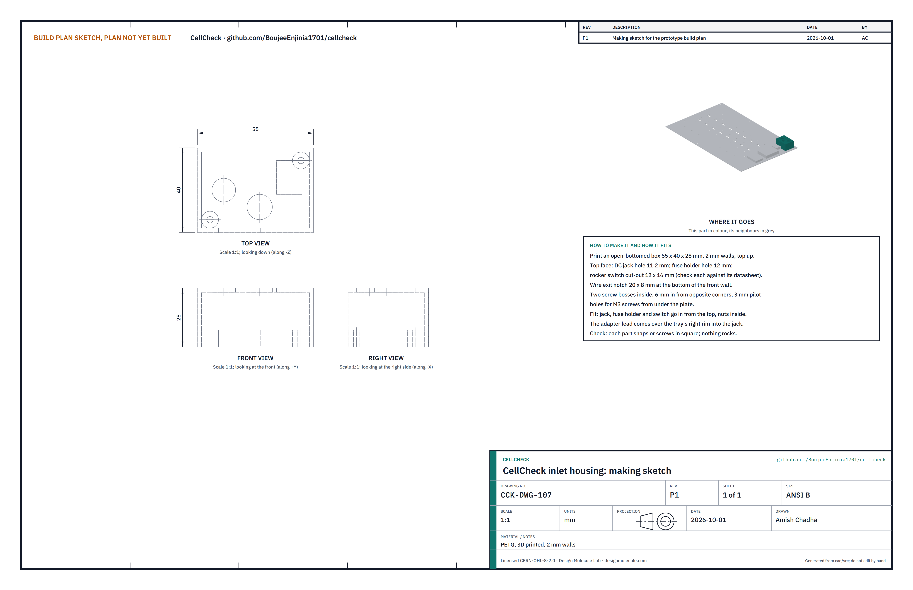

*Figure 13. Inlet housing making sketch (CCK-DWG-107).*

**What it is and what it is made from.** A small printed box at the back right that holds the DC jack, the 6.3 A fuse holder and the rocker switch where the 12 V supply comes in. PETG, 2 mm walls.

**How to make it.**

1. Print an open-bottomed box 55 x 40 x 28 with its top face up.
2. In the top face: an 11.2 mm hole for the jack, a 12 mm hole for the fuse holder and a 12 x 16 cut-out for the switch. Check each size against the part's datasheet before printing.
3. A 20 x 8 notch at the bottom of the front wall for the wires, and two screw bosses inside, 6 in from opposite corners, with 3 mm pilot holes.
4. Fit the jack, fuse holder and switch from the top with their nuts inside, and solder their wires before the housing goes on the plate.

**How it fits the parts next to it.**

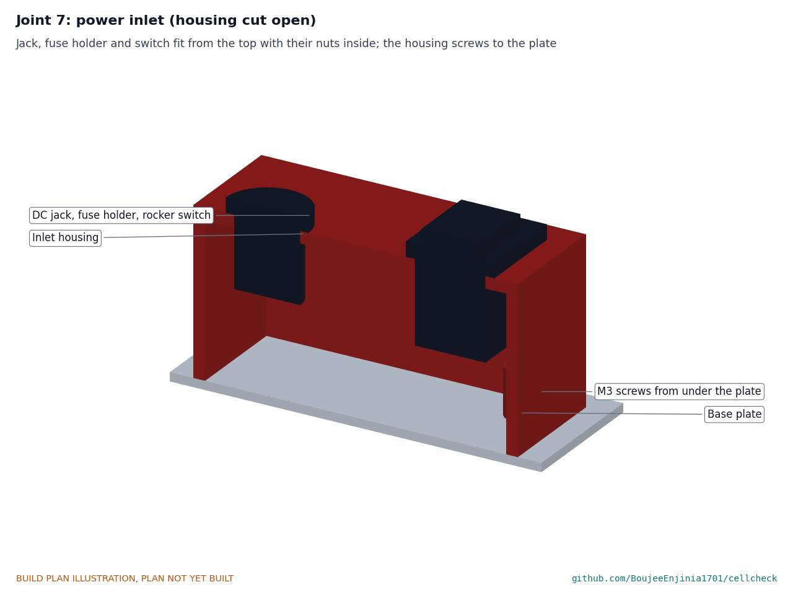

*Figure 14. The jack, fuse holder and switch fit from the top with their nuts inside; the housing screws to the plate from below.*

The housing stands on the plate at the back right, held by two M3 screws from under the plate into its bosses. The adapter's lead comes over the tray's right rim and plugs into the jack from above.

**Check before moving on.** Each part sits square and tight; nothing rocks.

### 3.8 Perforated guard

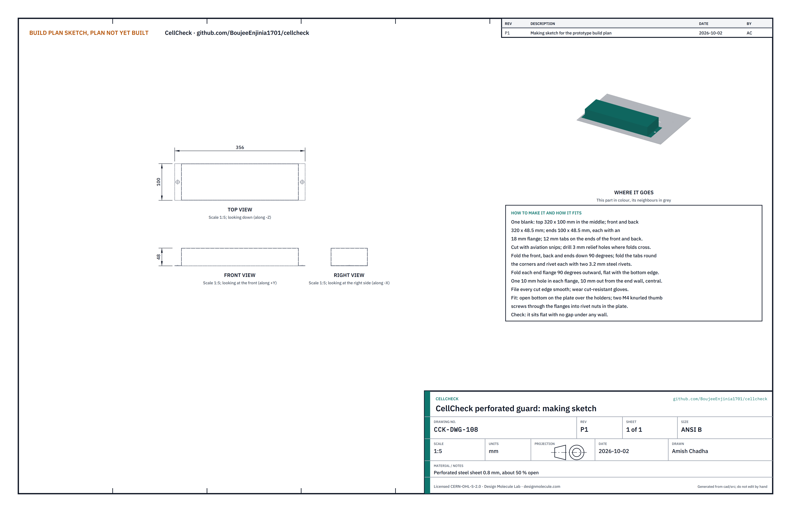

*Figure 15. Guard making sketch (CCK-DWG-108).*

**What it is and what it is made from.** The open-bottomed steel cover over the eight cells. It stops loose debris from a venting cell while letting the cells be seen and cooled, and it lifts off to change cells. Perforated steel sheet 0.8 mm, about 50 % open.

**How to make it.**

1. Mark one blank: a top 320 x 100 in the middle; a front and a back each 320 x 48.5 on the long edges; an end 100 x 48.5 on each short edge, each with an 18 mm flange beyond it; and a 12 mm tab on each end of the front and the back.
2. Cut with aviation snips and drill a 3 mm relief hole wherever two fold lines cross.
3. Fold the front, back and ends down 90°. Fold the tabs round the corners and rivet each with two 3.2 mm steel rivets.
4. Fold each end flange 90° outward, level with the bottom edge.
5. Drill a 10 mm hole in each flange, 10 out from the end wall and midway along it.
6. File every cut edge smooth.

**How it fits the parts next to it.**

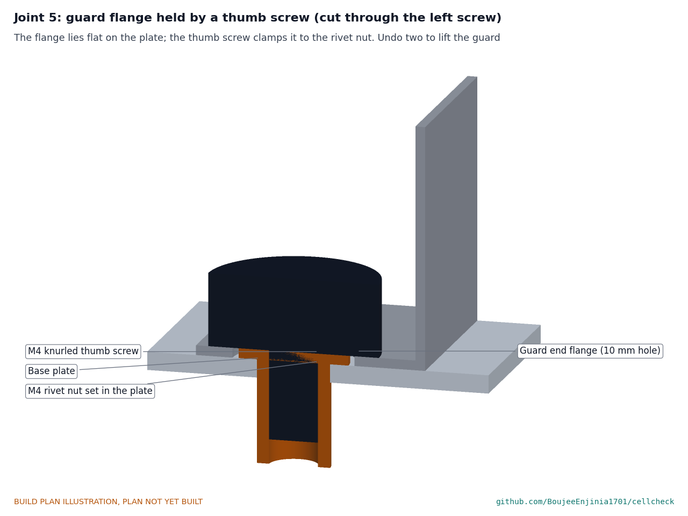

*Figure 16. The flange lies flat on the plate round the rivet nut; an M4 knurled thumb screw clamps it.*

The open bottom stands on the plate over the holders, 6 or more clear of them on every side and 12 above the thermistor clips. Each flange lies flat on the plate round a rivet nut and is held by one M4 knurled thumb screw with a 14 mm head. To change cells, undo the two thumb screws and lift the guard straight up.

**Check before moving on.** It sits flat on the plate with no gap under any wall.

### 3.9 Thermistor clips (print 8 for 21700 and 8 for 18650)

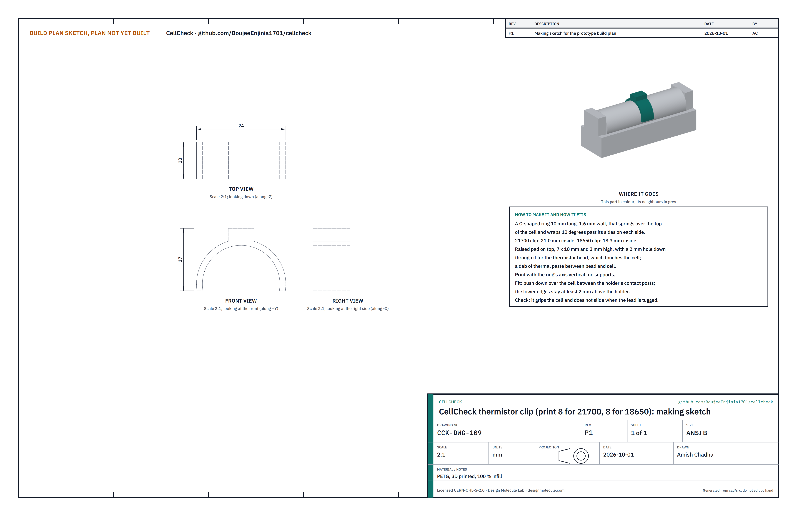

*Figure 17. Thermistor clip making sketch (CCK-DWG-109).*

**What it is and what it is made from.** A printed spring clip that holds each channel's temperature sensor against its cell. PETG, 100 % infill.

**How to make it.**

1. Print a C-shaped ring 10 long with a 1.6 mm wall, wrapping 10° past the cell's sides on each side: 21.0 inside for 21700 cells and 18.3 inside for 18650 cells. Print with the ring's axis upright, no supports.
2. On top, a raised pad 7 x 10 and 3 high with a 2 mm hole down through it.
3. Push the thermistor bead into the hole until it stands just proud of the inside face, with a dab of thermal paste, and glue its lead to the pad.

**How it fits the parts next to it.**

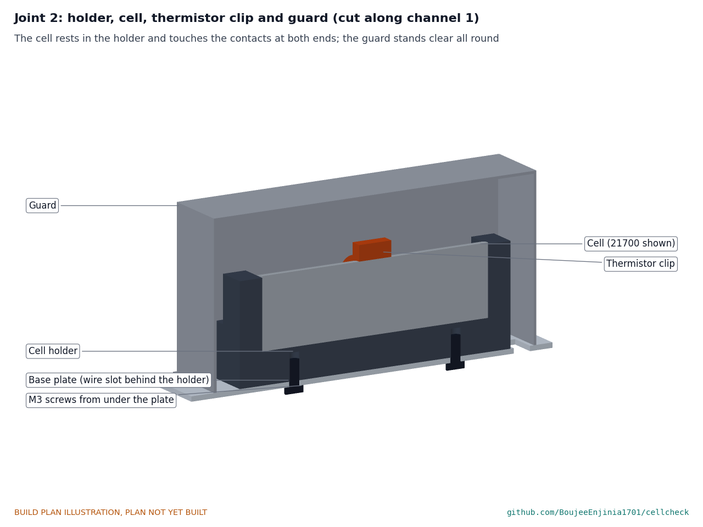

*Figure 18. The cell rests in the holder and touches the contacts at both ends; the clip springs over the middle of the cell; the guard stands clear all round.*

The cell rests in the holder's groove and touches its force and sense contacts at both ends. The clip pushes down over the middle of the cell between the contact posts; its lower edges stay at least 2 above the holder. Its lead runs down into the wire slot behind the holder.

**Check before moving on.** On a spare cell the clip grips and does not slide when its lead is tugged.

### 3.10 Rest rack

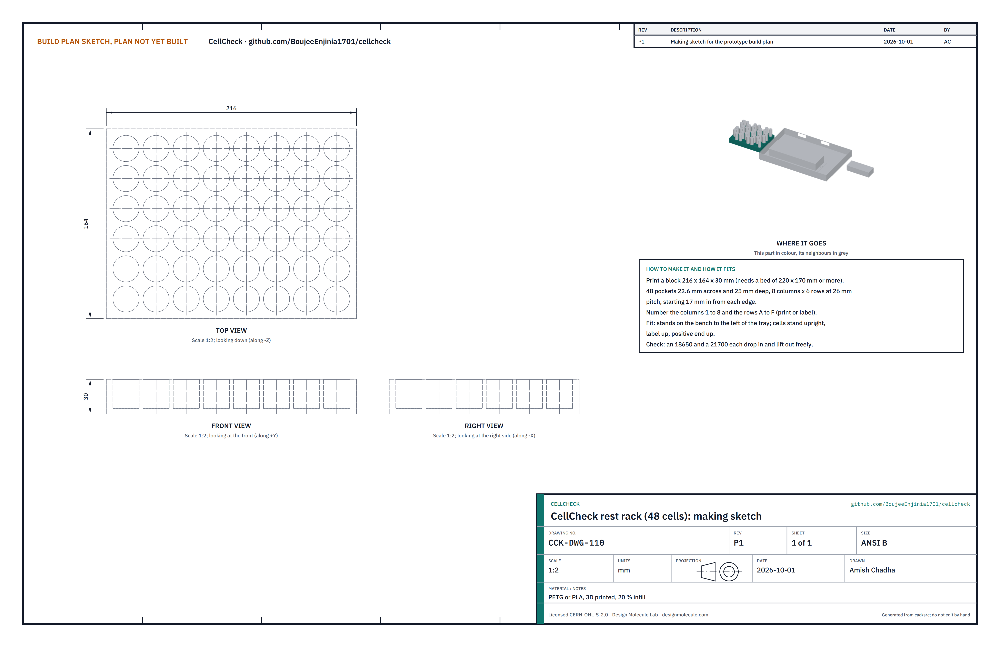

*Figure 19. Rest rack making sketch (CCK-DWG-110).*

**What it is and what it is made from.** A printed block that holds 48 cells upright and numbered during their 14-day rest. PETG or PLA, 20 % infill.

**How to make it.**

1. Print a block 216 x 164 x 30 on a bed of at least 220 x 170.
2. 48 pockets 22.6 across and 25 deep, 8 columns by 6 rows at 26 pitch, the first 17 in from each edge.
3. Number the columns 1 to 8 and the rows A to F.

**How it fits the parts next to it.** It stands on the bench to the left of the tray. Cells stand in it upright, label up, positive end up, with no current flowing.

**Check before moving on.** An 18650 and a 21700 each drop in and lift out freely.

### 3.11 Wiring

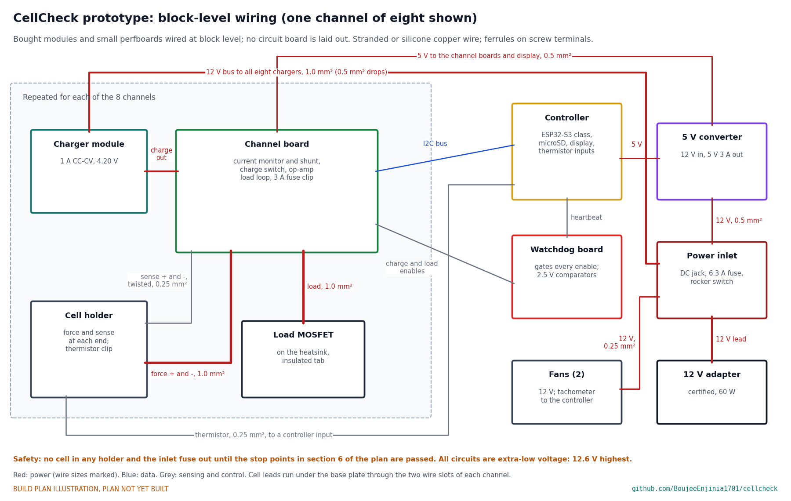

*Figure 20. Block-level wiring with wire sizes, one channel of eight shown. No circuit board is laid out at this stage; bought modules and small perfboards stand in.*

The channel board in the bill of materials is not a custom board, which would be TRL 4 work. For this prototype, buy modules that meet this specification:

*Table 2. Modules and perfboards.*

| Module | What to buy or make |
| --- | --- |
| Charger | Single-cell lithium-ion constant-current, constant-voltage buck charger, 1 A, 4.20 V within 1 %, 12 V input (TP5100 class), with mounting holes |
| Channel board | A current and voltage monitor breakout (INA226 class) with its shunt changed to 25 mΩ 0.5 %, on a small perfboard that also carries the series charge switch transistor, the op-amp of the load loop, its sense resistor and fuse clips for a 3 A fast fuse; each board with its own bus address |
| Load transistor | Logic-level MOSFET in TO-220 with an insulating pad and shoulder washer |
| Watchdog board | Perfboard with a hardware watchdog timer that removes every charge and load enable if the controller stops, and eight 2.5 V comparators that remove each load's drive |
| Controller | ESP32-S3 class board with a microSD slot |
| 5 V converter | Buck converter, 12 V in, 5 V 3 A out, with mounting holes |

Wire it like this, with silicone or stranded copper wire, soldered or crimped joints, and heat-shrink on every bare joint:

1. Jack to fuse holder to switch to the 12 V bus: 1.0 mm² (18 AWG).
2. 12 V bus to each charger input: 1.0 mm² for the bus, 0.5 mm² (20 AWG) for each drop. 12 V to each fan and to the converter: 0.25 mm² (24 AWG) and 0.5 mm².
3. Converter 5 V output to the controller, display and every channel board: 0.5 mm².
4. Each charger's output to its channel board (charge switch, shunt and fuse in series): 1.0 mm².
5. Channel board to the cell holder, positive and negative force leads: 1.0 mm², down through the slot behind the holder and up through the slot beside the channel board. The positive lead goes through the 3 A fuse on the channel board.
6. Each holder's two sense leads to its channel board: 0.25 mm², twisted, along the same path.
7. Channel board to its load transistor's drain, source and gate: 1.0 mm² for drain and source, 0.25 mm² for the gate.
8. Thermistor leads from each clip, down the same slot, to a controller input: 0.25 mm².
9. Controller to every channel board on one I2C bus; controller heartbeat to the watchdog board; watchdog board to every charge and load enable: 0.25 mm².
10. Fan tachometer leads to the controller: 0.25 mm².

**Check before moving on.** Every wire continues end to end; the inlet fuse is out; no lead is pinched at a slot; every wire is labelled with its channel.

### 3.12 Bought components

Buy to specification, not brand. Line numbers are those of the bill of materials.

- **Cell holders (line 3).** Eight adjustable holders for 18650 and 21700 cells up to 70 mm long, spring contacts with separate force and sense leads at each end, and two M3 fixing holes in the base.
- **Thermistors (line 4).** Eight 10 kΩ 1 % NTC thermistors, B value 3950.
- **Charger modules, channel boards, load transistors (lines 6 to 8), controller (line 11), watchdog board (line 18), 5 V converter (line 21).** As Table 2.
- **Fans (line 10).** Two 60 mm 12 V fans with a tachometer lead and a 50 mm screw pattern, each with a 60 mm finger guard.
- **Display and buttons (line 12).** A 2.8 in SPI display module about 86 x 50 mm with four corner holes, and three panel-mount push buttons for 7 mm holes.
- **Inlet parts (line 13).** Panel-mount DC jack to suit the adapter's plug, panel fuse holder with a 6.3 A fuse, rocker switch for a 12 x 16 cut-out.
- **Adapter (line 14).** A certified 12 V 5 A (60 W) adapter with the safety marks of the country of use. Never a bare or uncertified supply.
- **Wiring (line 16).** Silicone wire as section 3.11, eight 3 A fast fuses, connectors, heat-shrink, edge grommet strip and a tube of high-temperature silicone sealant for the wire slots.
- **Labels (line 17).** Cell ID labels, insulator rings and wraps.
- **Rubber feet (line 19).** Six rubber feet about 20 across and 8 tall with M4 x 8 steel studs.
- **Fixings (line 20).** Stainless: 6 M4 x 12 hex standoffs (line 2); 6 M4 x 8 screws (plate); 16 M3 x 8 screws (holders); 3 M3 x 10 screws (heatsink); 8 M3 x 10 screws with shoulder washers (transistors); 4 M3 x 6 screws (shroud); 8 fan screws; 38 M3 x 8 screws and 38 5 mm nylon standoffs (boards); 4 M3 x 8 screws (display stand and inlet); 2 M4 blind rivet nuts for 0.5 to 3 mm sheet; 2 M4 x 10 knurled thumb screws with 14 mm heads; 16 3.2 mm steel rivets (guard).

## 4. Putting it together

In each picture the parts already fitted are grey and the part being fitted is in colour, with an arrow showing the way it goes in. Build the plate assembly (steps 3 to 9) on the bench, then lower it into the tray.

### Step 1: feet and standoffs onto the tray

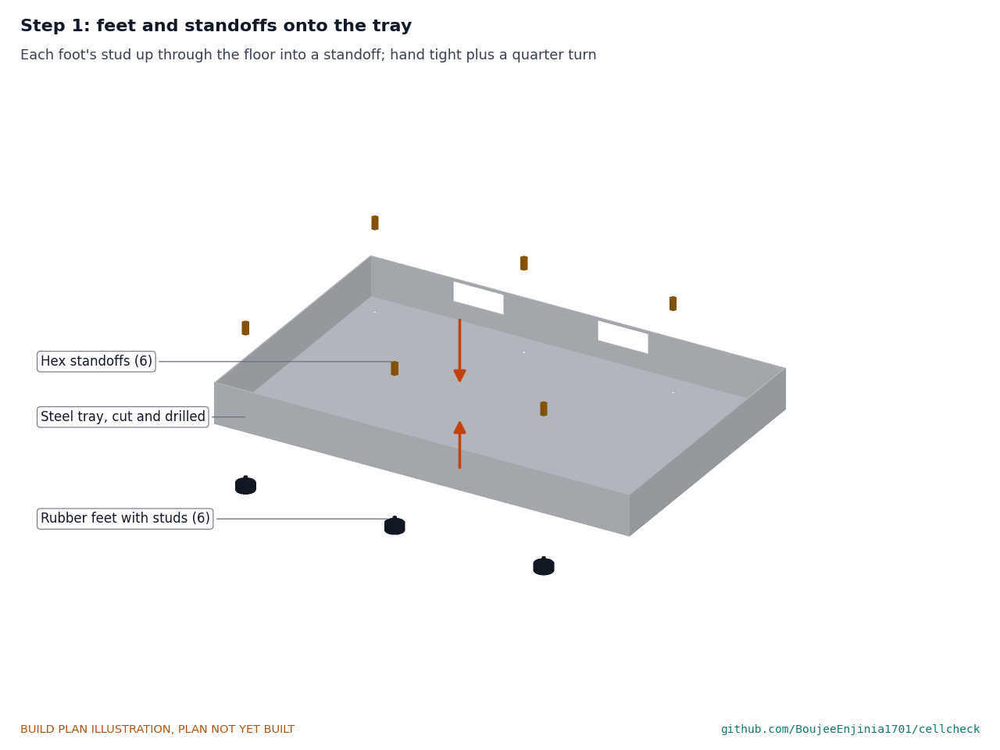

Put each foot's stud up through its hole in the floor and screw a hex standoff onto it from inside; hand tight plus a quarter turn.

### Step 2: liner into the tray

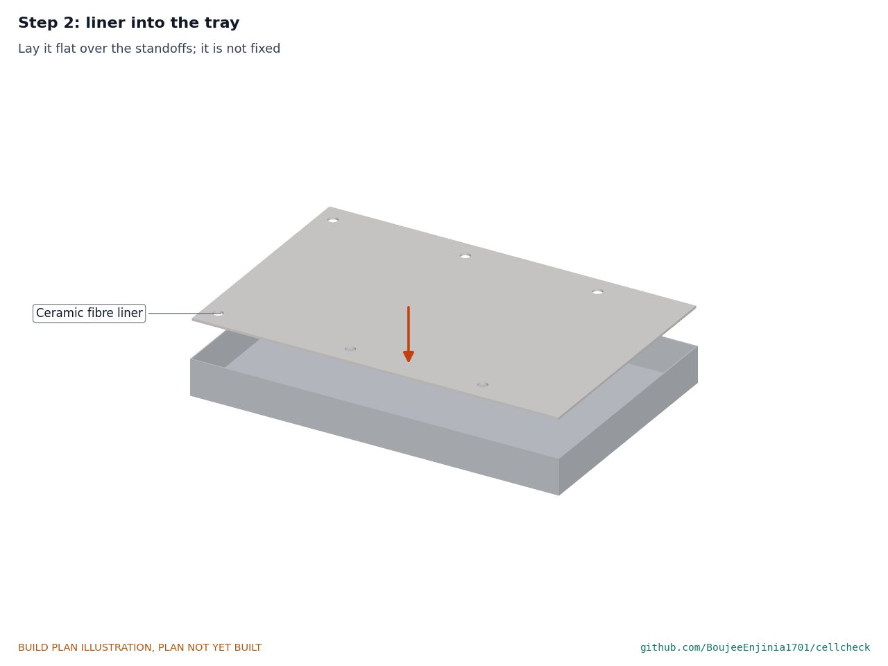

Lay the liner flat on the floor with a standoff through each of its holes. It is not fixed.

### Step 3: cell holders and rivet nuts onto the base plate

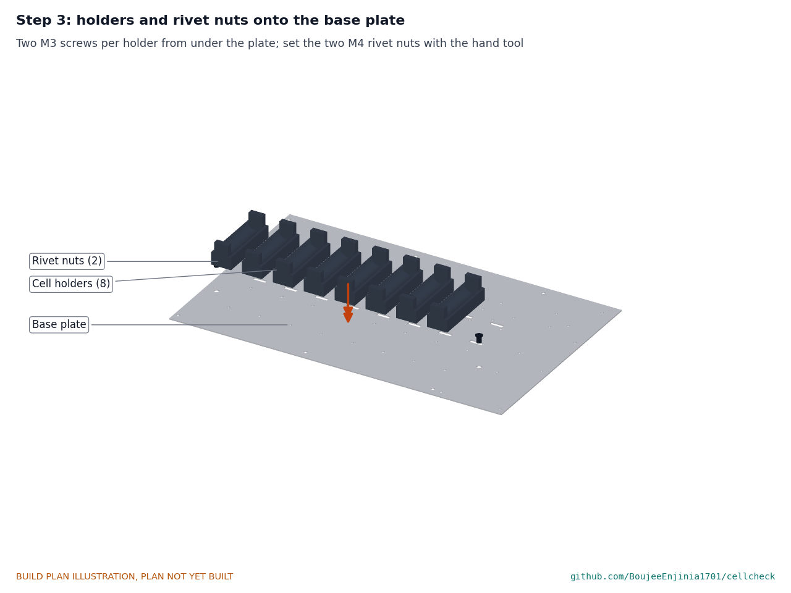

Each holder on its two screw holes, two M3 screws from under the plate, snug. The rivet nuts are already set (section 3.3).

### Step 4: chargers and channel boards onto the plate

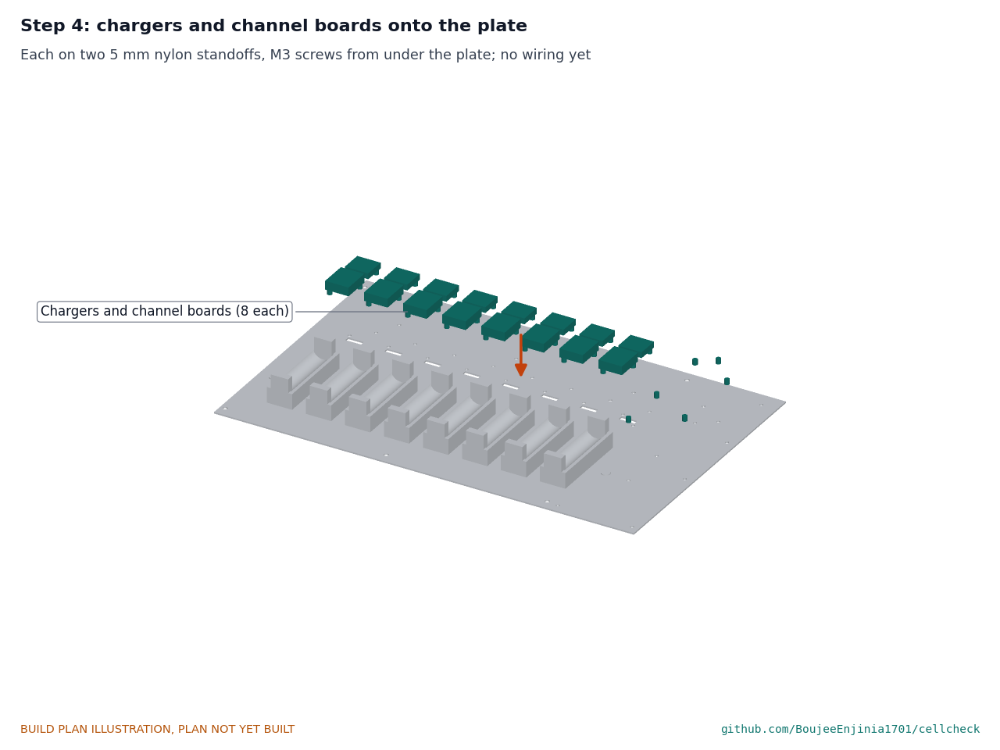

Each board on two 5 mm nylon standoffs, M3 screws from under the plate. No wiring yet.

### Step 5: load transistors onto the heatsink

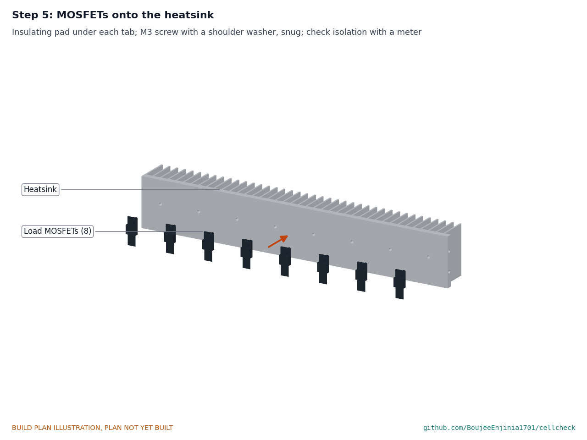

Insulating pad under each tab, M3 screw with a shoulder washer, snug. **Hold point:** with a meter on its resistance range, every tab reads open to the heatsink.

### Step 6: heatsink onto the plate

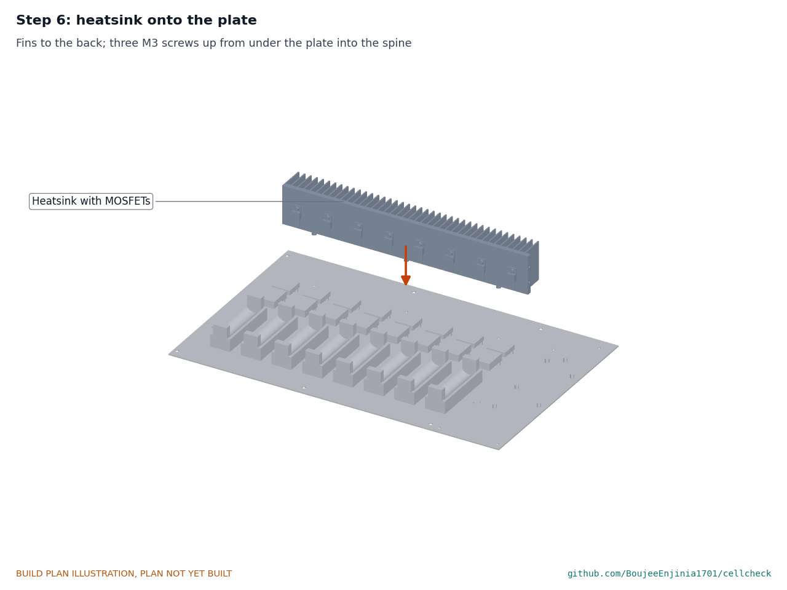

Fins to the back. Three M3 screws up from under the plate into the spine's bottom edge.

### Step 7: fan shroud and fans onto the heatsink

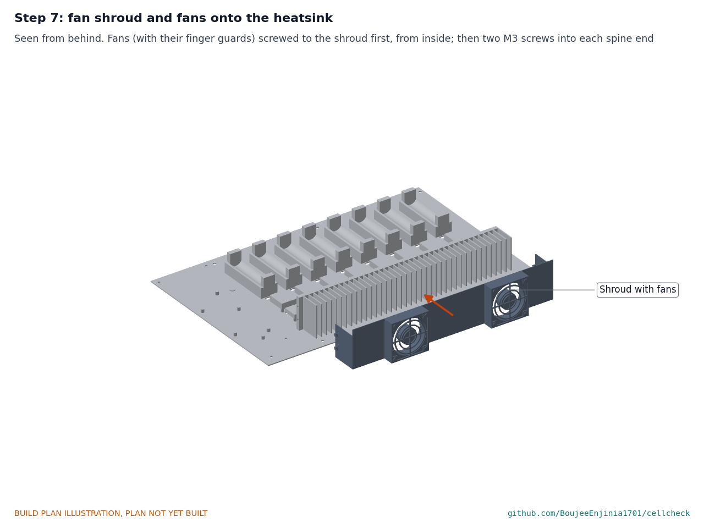

With the fans already screwed to the shroud, slide its flanges over the spine ends and fit two M3 screws each side.

### Step 8: controller, watchdog board, converter, display and inlet

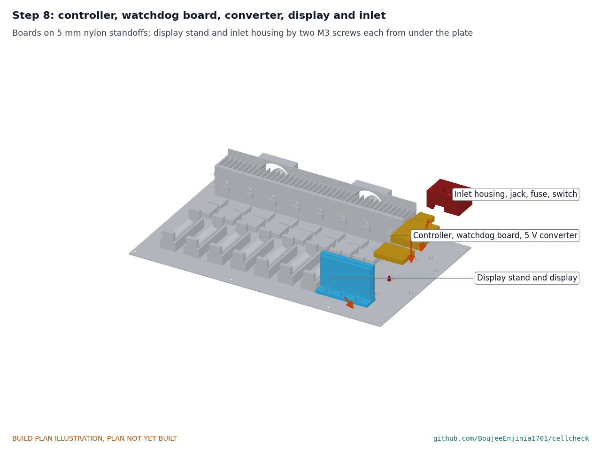

Controller, watchdog board and converter on 5 mm nylon standoffs; display stand and inlet housing by two M3 screws each from under the plate.

### Step 9: wiring

Wire the plate as section 3.11 and Figure 20, with the inlet fuse out and no cell anywhere near. Run the cell leads down the slot behind each holder, along the underside of the plate and up the slot beside the channel board. **Hold point:** the wiring checks of section 3.11 pass. Then fill each wire slot round its leads with high-temperature silicone, from above and below, and let it cure before step 10; this closes the space under the guard again.

### Step 10: plate assembly into the tray

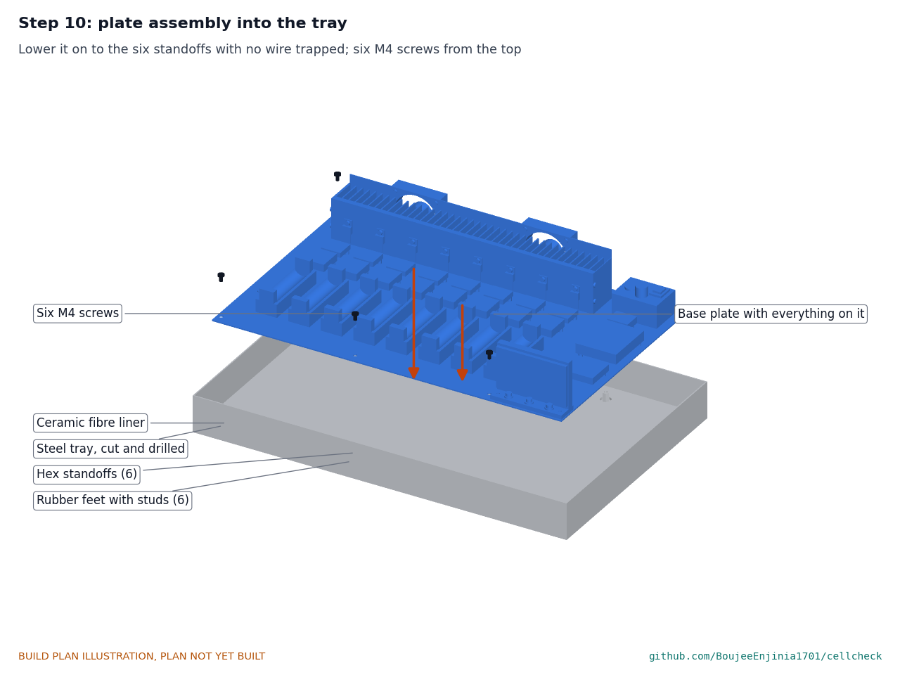

Lower the plate onto the six standoffs, checking that no lead under it is trapped. Six M4 screws from the top.

### Step 11: guard over the cell holders

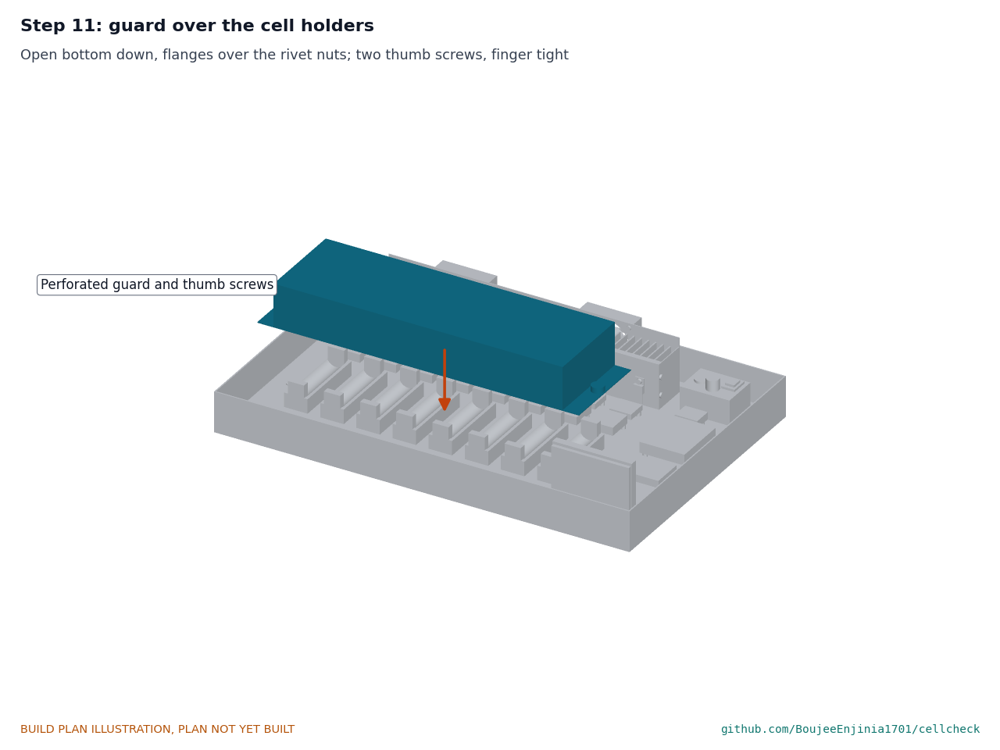

Open bottom down, flanges round the rivet nuts; two thumb screws, finger tight.

### Step 12: rest rack and adapter on the bench

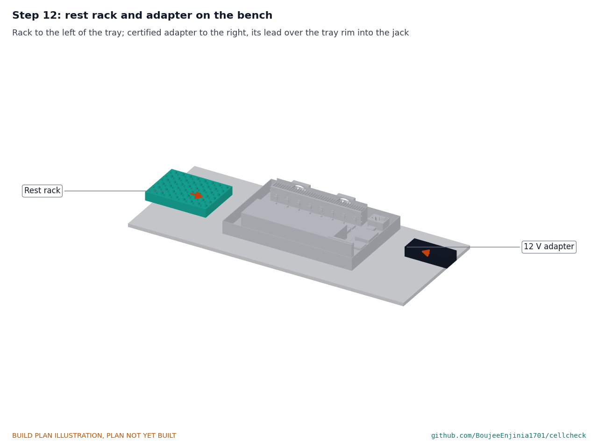

The rest rack to the left of the tray, the adapter to the right on the bench, its lead over the tray's right rim into the jack. Leave the adapter unplugged from the mains until stop S3.

## 5. First checks

These are the checks a TRL 4 test report would record; this plan only lists them. Requirement numbers are those of CCK-REQ-001.

*Table 3. First checks.*

| Check | Requirement | How | Pass when |
| --- | --- | --- | --- |
| Cells fit | R1 | Put a known-good 18650 and then a 21700 in every holder, guard off, no power | Each seats on both contacts; the clip fits; the guard goes back on without touching a cell or clip |
| Guard seated | R10 | Guard on, thumb screws tight; feeler gauge under every wall | No gap over 0.5 mm anywhere along the walls |
| Supply voltages | R13 | Adapter connected, no cells, inlet fuse in; meter on the 12 V bus and the 5 V rail | 12 V bus at 12.6 V or less; 5 V rail within 5 % |
| Charger voltage | R9, R13 | No cell; meter across each holder's contacts with the charge switch on | 4.20 V within 1 % on every channel |
| Watchdog | R9 | Hold the controller in reset while a channel's charge and load are enabled | Every enable drops within the watchdog time |
| Undervoltage cut | R9 | Bench supply in place of a cell, lowered slowly from 3.0 V with the load enabled | The load drive is removed at 2.5 V, within 0.05 V |
| Voltage reading | R3 | Bench supply at 3.0 and 4.2 V on each channel, against a calibrated meter, then two-point calibration | Each channel within 10 mV after calibration |
| Temperature reading | R7 | Each thermistor beside a reference thermometer at room temperature | Within 2 K |
| Fans and heatsink | R8 | Fans on; tachometer readings at the controller | Both fans read; air comes out of the fin tops |
| Mass and size | R11 | Weigh the unit without the adapter; measure | 5 kg or less (4.91 kg estimated); within 500 x 320 x 120 mm |

## 6. Safety stops

Stop at each point. Carry on only when everything listed is true.

- **S1. Before any cell comes into the workshop.** A non-flammable bench (steel or ceramic tile) with a smoke alarm above it; a Class D or large dry-powder extinguisher or a bucket of dry sand within reach; a lidded metal container of sand for a hot or damaged cell; insulated tools.
- **S2. Before the inlet fuse goes in.** Wiring checks of section 3.11 pass; every transistor tab reads open to the heatsink; with the fuse out, the 12 V bus reads open to the plate and to ground.
- **S3. Before the adapter is plugged into the mains.** The adapter is a certified unit, undamaged, with the right safety marks; no cell is in any holder; the guard is on.
- **S4. Before the first cell goes into a holder.** The charger voltage, watchdog, undervoltage and temperature checks of section 5 pass on every channel.
- **S5. First charge.** One cell that has passed intake (no damage, above 2.0 V), in one channel, guard on, thermistor clip fitted, a person present the whole time. Stop and disconnect if the cell passes 45 °C or rises 8 K above the bench, or reads above 4.25 V.
- **S6. First discharge.** Fans running and read by the controller; hands off the heatsink. Stop if a fan stops or the heatsink passes 70 °C.
- **S7. Before leaving anything unattended.** Only cells in the rest rack, with no current flowing; the grader switched off at the rocker switch and unplugged.

## 7. Tools, skills and workspace

**Tools.** Hacksaw, nibbler or fine-tooth jigsaw for sheet; bench drill or a drill in a stand; drills 2.5 to 12 mm and a step drill; hole saw 54 mm; M3 tap and tap wrench with cutting fluid; blind rivet nut tool for M4; hand rivet tool for 3.2 mm rivets; aviation snips; sheet folder for 1 mm aluminium and 0.8 mm steel up to 330 mm long (or two lengths of hardwood angle clamped in a vice); flat and half-round files; deburring tool; scriber, engineer's square, steel rule and calipers; sharp knife and 12 mm hole punch for the liner; 3D printer with a bed of at least 220 x 170 mm that prints PETG; temperature-controlled soldering iron; wire strippers and crimper; multimeter; bench power supply with an adjustable current limit (0 to 15 V, 0 to 3 A); feeler gauges; scale to 10 kg.

**Skills.** No certified trade is needed. Basic metalwork (marking out, sawing, drilling, tapping, folding thin sheet, setting rivets and rivet nuts), 3D printing, through-hole soldering and crimping, safe use of a bench power supply, and the care with lithium-ion cells set out in section 6. All circuits are extra-low voltage, 12.6 V at most, from a certified adapter; no mains wiring is part of this build.

**Workspace.** A non-flammable bench about 1.2 x 0.6 m for the grader and the rest rack, with the stop S1 equipment; a metalwork corner kept apart from the electronics so chips stay off the boards; a ventilated place for the printer; a well-ventilated or outdoor place to cut ceramic fibre.

**Personal protective equipment.** Safety glasses for cutting, drilling, soldering and every cell test; cut-resistant gloves for sheet work; a dust mask (FFP2 or N95), gloves and long sleeves for ceramic fibre; hearing protection when sawing; no gloves near a turning drill.

## 8. Where the numbers come from

- Model and constructability checks: `cad/src/model.py` (`python cad/src/model.py --check`, 129 checks); STEP and STL exports in `cad/step/` and `cad/stl/`.
- Pictures: `cad/src/build_plan_media.py`, using `.kit/build_views.py`; written to `docs/05-build-plan/` and `cad/drawings/CCK-DWG-101` to `CCK-DWG-110`.
- General arrangement: `cad/drawings/CCK-DWG-001.pdf`, Rev P2.
- Calculations: `docs/04-calcs/01-sizing.md` (CCK-CAL-001 v0.3) and `docs/04-calcs/sizing.py`; size and mass in section 8, cost in section 11, heatsink in section 4, single-fault analysis in section 6.
- Bill of materials: `bom/bom.csv`.
- Decisions: `docs/decisions/0003-design-for-construction.md` (CCK-DDR-003), with CCK-DDR-001 and CCK-DDR-002; decisions made and still open in `docs/06-design-decisions.md` (CCK-DEC-001).
- Requirements: `docs/03-requirements.md` (CCK-REQ-001 v0.5).
